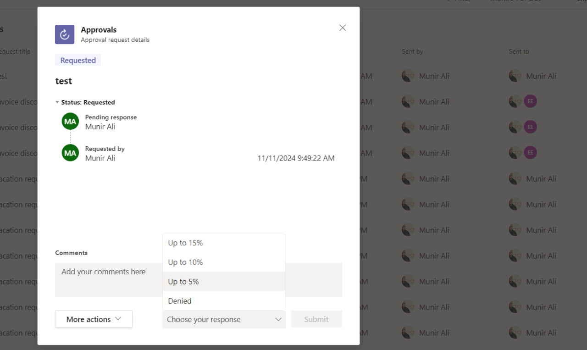
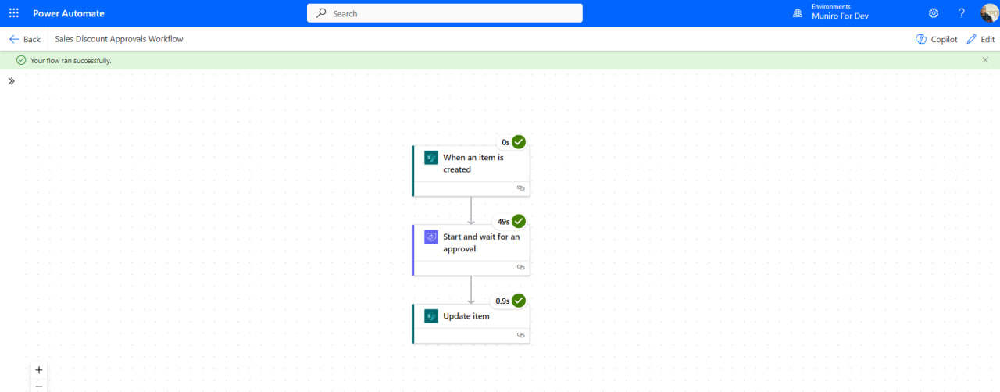
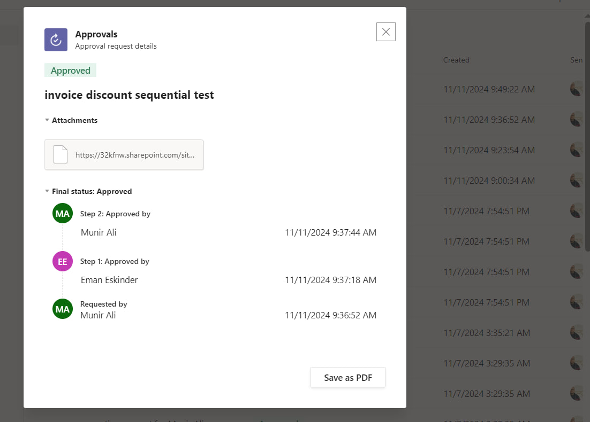
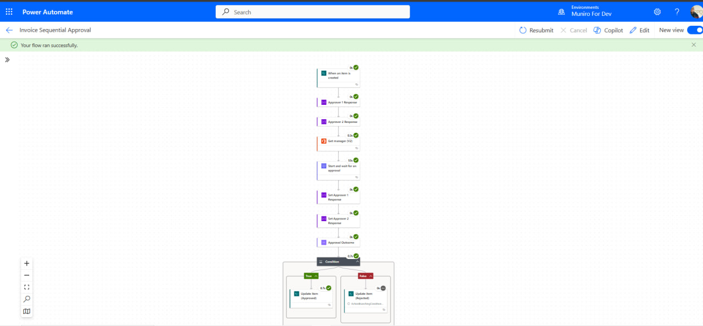
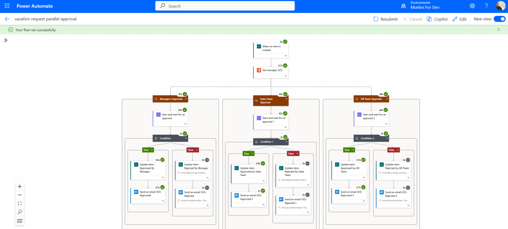
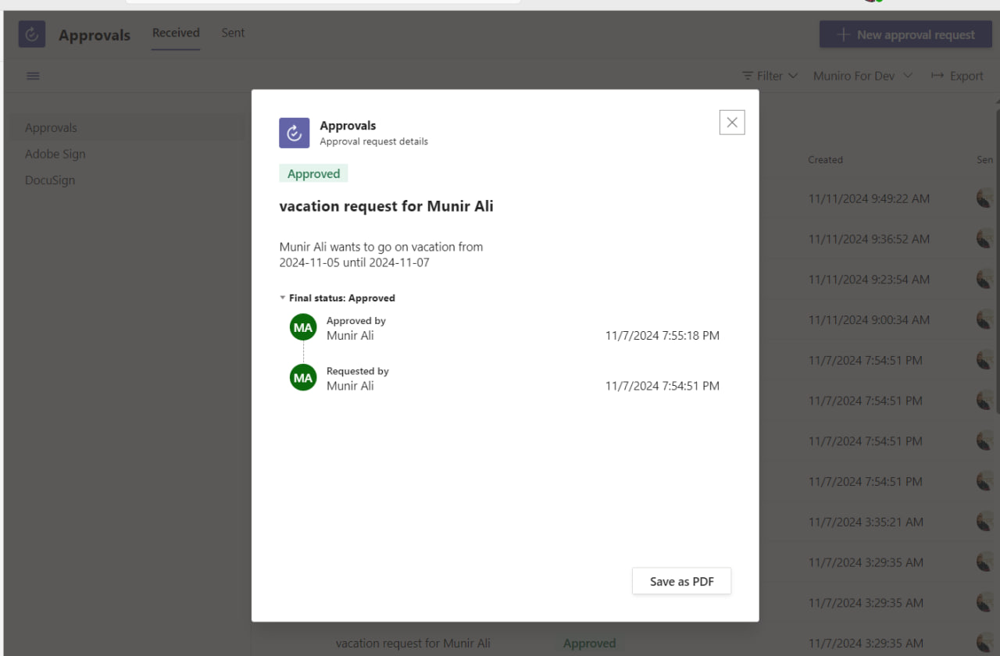
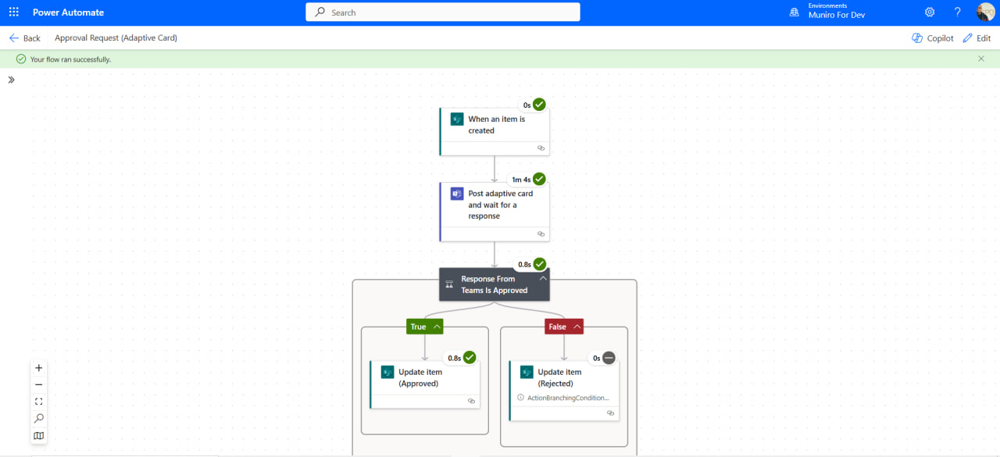
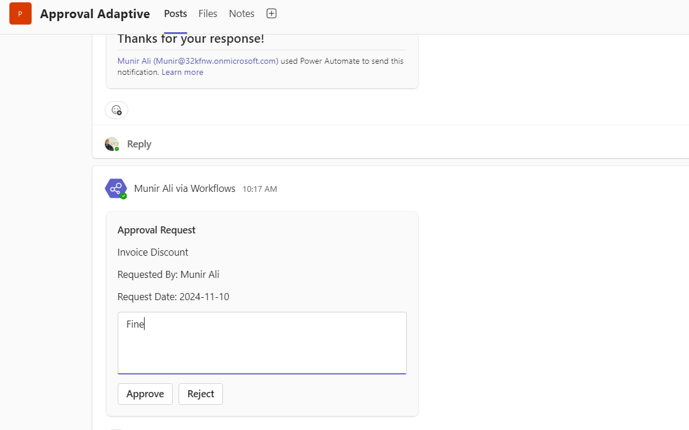

# Approval Workflow Automation Project

## Overview
A **Power Automate**-based project designed to streamline the approval process for various business scenarios. This solution integrates custom approvals, sequential and parallel workflows, and adaptive card-based Teams notifications, allowing users to manage requests efficiently across departments.

---

## Features

### 1. Custom Approval Requests
Standardizes the approval process for discount requests by providing preset options to approvers.

- **Options**: `Up to 5%`, `Up to 10%`, `Up to 15%`, `Denied`
- **Functionality**: Approvers select from these preset options, creating a uniform decision-making process for discount approvals.

#### **Image**:

---

### 2. Sequential Approvals
Multi-step approval process that retrieves the requestor's manager from a SharePoint list and automatically updates the item based on the final response.

- **Approval Process**: 
  - Sequentially gathers approvals.
  - Updates the item as "Approved" only if both managers agree.
  - If rejected by any manager, the item is updated as "Rejected."
  
- **Use Case**: 
  - Ideal for scenarios like invoice or discount requests that require multi-tiered verification.

#### **Image**:

---

### 3. Parallel Approval Requests
Initiates simultaneous approval requests across multiple departments, allowing for faster decision-making.

- **Departments Involved**: 
  - Manager, Sales, and HR teams
  
- **Outcome**: 
  - The item status is updated based on the aggregated responses from all departments, enabling quick cross-functional decisions.

#### **Image**:

---

### 4. Microsoft Teams Adaptive Card Approvals
Posts approval requests directly within **Microsoft Teams** using adaptive cards, allowing approvers to respond without leaving Teams.

- **Functionality**: 
  - Users interact with adaptive cards within Teams to approve or reject requests seamlessly.
  
- **Use Case**: 
  - Ideal for quick responses and enhanced accessibility, especially for users working primarily in Teams.

#### **Image**: 

---
## Connect with Me:

- LinkedIn: [Munir Ali ](https://www.linkedin.com/in/munir-ali-7b9607234/)
