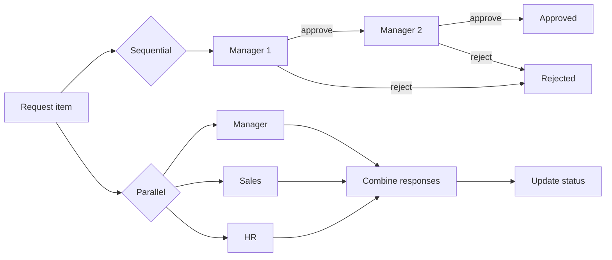
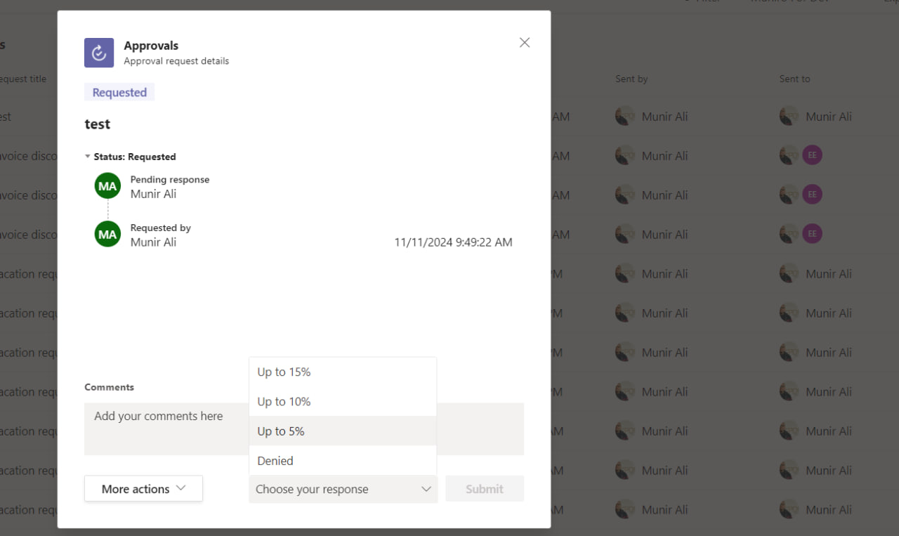
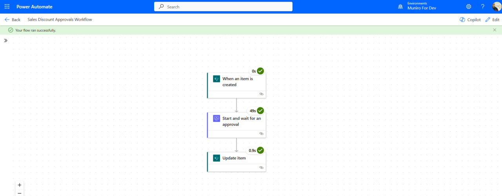
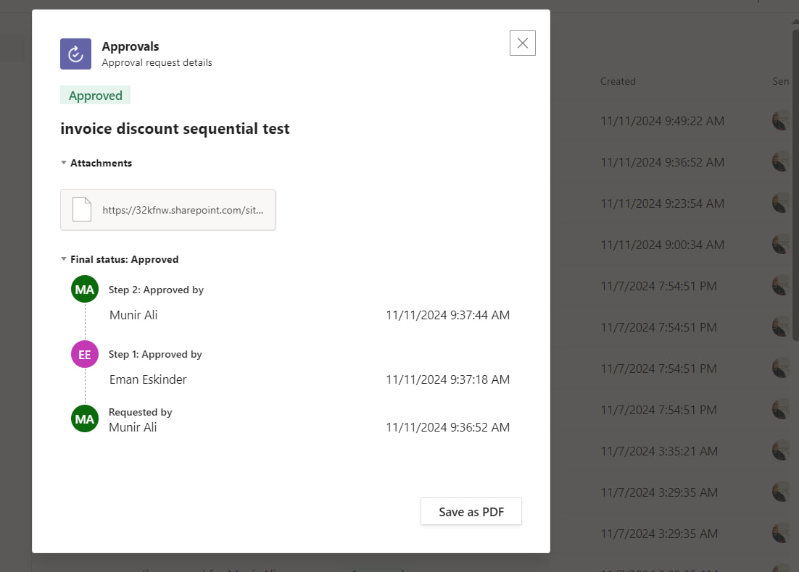
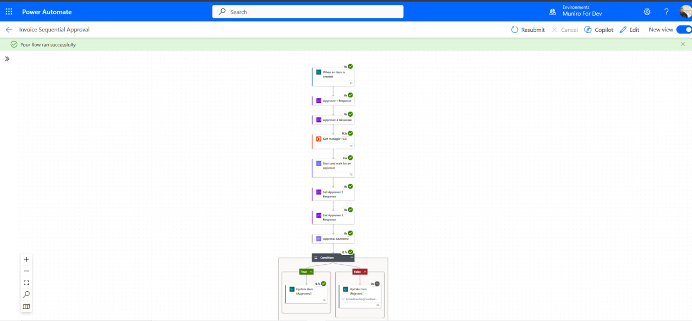
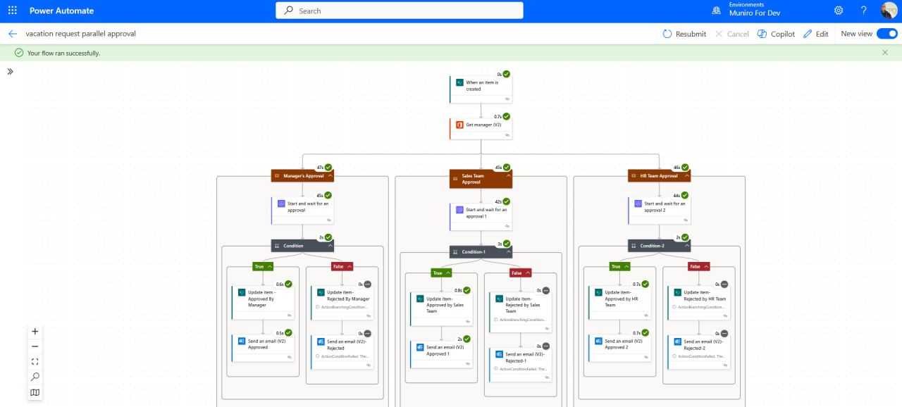
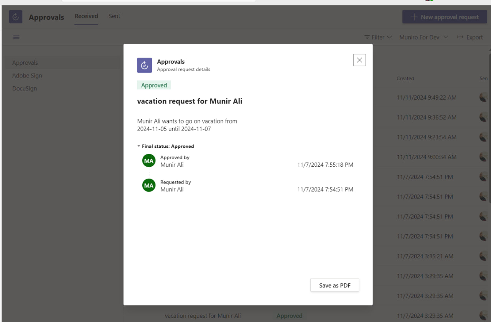
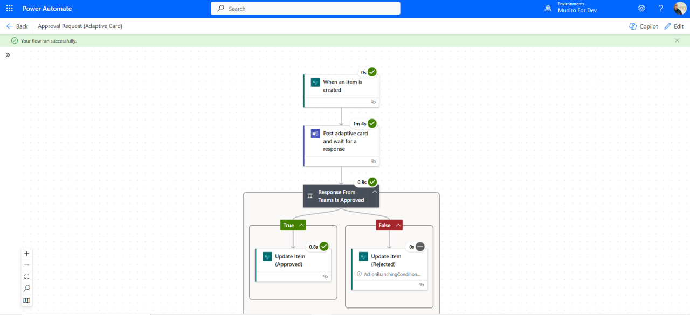
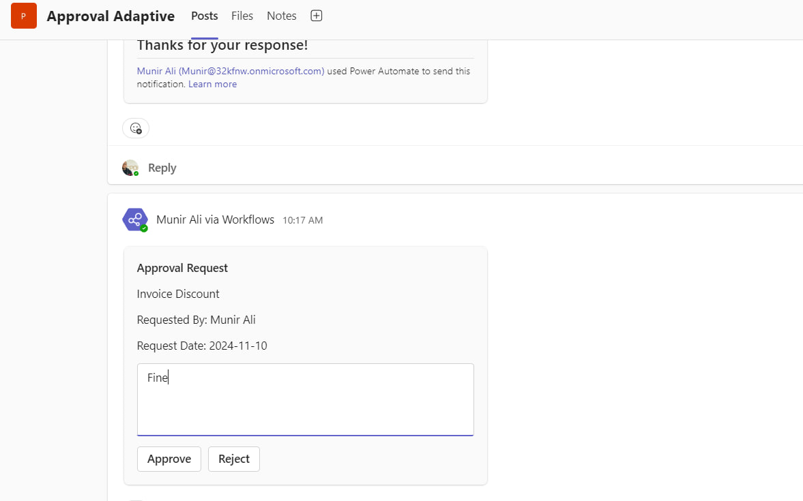

  

**Four Power Automate approval patterns for everyday business requests: custom responses, sequential, parallel and Teams adaptive cards.**

  
  
  
  
  

## The problem

Requests such as discounts and invoices often need one approver, several in sequence, or several departments at once. Chasing those decisions by email is slow and inconsistent.

## Key features

- **Custom responses.** Discount approvers choose from fixed options (`Up to 5%`, `Up to 10%`, `Up to 15%`, `Denied`) instead of typing a free-text decision.
- **Sequential approvals.** The flow looks up the requester's manager in a SharePoint list and routes the request through two managers in turn. The item is marked **Approved** only if both approve, and **Rejected** as soon as either rejects.
- **Parallel approvals.** Manager, Sales and HR receive the request at the same time, and the item status is set from their combined responses.
- **Teams adaptive cards.** Approvals are posted as adaptive cards in Microsoft Teams, so approvers can respond without leaving Teams.

```mermaid
flowchart LR
  R[Request item] --> SEQ{Sequential}
  SEQ --> M1[Manager 1] -->|approve| M2[Manager 2] -->|approve| OK[Approved]
  M1 -->|reject| NO[Rejected]
  M2 -->|reject| NO
  R --> PAR{Parallel}
  PAR --> PM[Manager] & PS[Sales] & PH[HR] --> AGG[Combine responses] --> ST[Update status]
```

## Screenshots

### Custom approval requests

### Sequential approvals

### Parallel approvals

### Teams adaptive card approvals

---

Built by [Munir Ali](https://www.linkedin.com/in/munir-ali-7b9607234/) · [Back to portfolio](../README.md)
