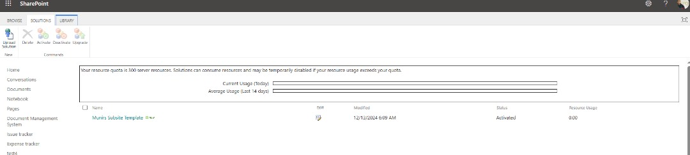
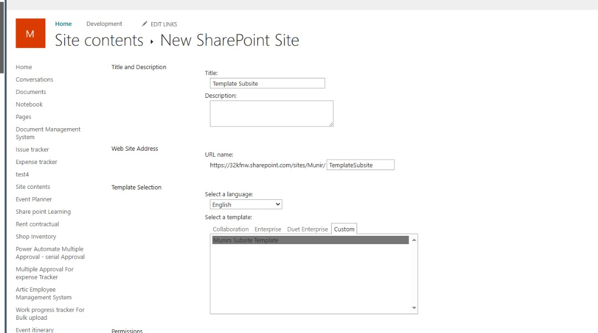
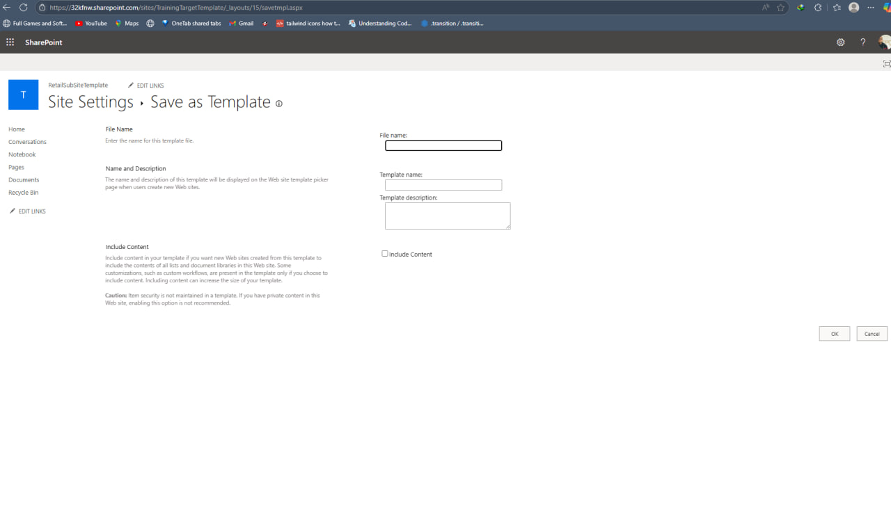

🏗️ SharePoint Site Template Integration Automation

🌟 Overview

This project aims to automate the process of integrating SharePoint site templates, enhancing efficiency and streamlining operations.

# Efficiency

Automates the creation and deployment of SharePoint subsites.
Saves time by eliminating manual template configuration.
Ensures a consistent and efficient workflow.

# Key Features

✅ Enables the use of site templates for existing SharePoint sites.
✅ Automates the integration of templates into subsites.
✅ Utilizes PowerShell scripting for seamless and automated deployment.
✅ Eliminates manual errors and reduces the need for repetitive tasks.

# Technologies

🔹 SharePoint Online
🔹 PowerShell Scripting
🔹 Microsoft Online Management Shell

# Prerequisites

Before running the automation:

✅ Install the SharePoint Online Management Shell:

Install-Module -Name Microsoft.Online.SharePoint.PowerShell

✅ Ensure admin access to the SharePoint Online Admin Center.
✅ Have valid tenant name and site URLs.

# Step-by-Step Guide

1️⃣ Connect to SharePoint Admin Center:

Connect-SPOService -Url https://TenantName-admin.sharepoint.com

2️⃣ Prepare Target Site:

Set-SPOSite -Identity https://TenantName.sharepoint.com/sites/TemplateSiteName -DenyAddAndCustomizePages $false

3️⃣ Save Site as Template:

Navigate to Site Settings of the target site.
Select "Save site as template" under Site Actions.
Provide a name for the template and save it.

4️⃣ Integrate Template on Subsite:

Set-SPOSite -Identity https://TenantName.sharepoint.com/sites/TargetSubsite -DenyAddAndCustomizePages $false

5️⃣ Apply Template:

Go to the target subsite's Site Settings.
Under Site Actions, select "Solutions".
Activate the saved template and create the subsite.

# Full Automation Script

# Connect to SharePoint Admin Center
Connect-SPOService -Url https://TenantName-admin.sharepoint.com

# Prepare Target Site
Set-SPOSite -Identity https://TenantName.sharepoint.com/sites/TemplateSiteName -DenyAddAndCustomizePages $false

# Integrate Template on Subsite
Set-SPOSite -Identity https://TenantName.sharepoint.com/sites/TargetSubsite -DenyAddAndCustomizePages $false

# Screenshots
## Project Images 
****
****
****
****

## Connect with Me:

- LinkedIn: [Munir Ali ](https://www.linkedin.com/in/munir-ali-7b9607234/)
