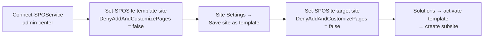
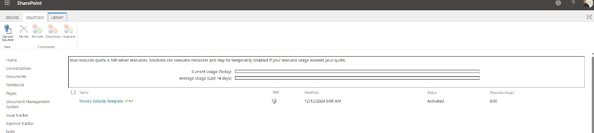
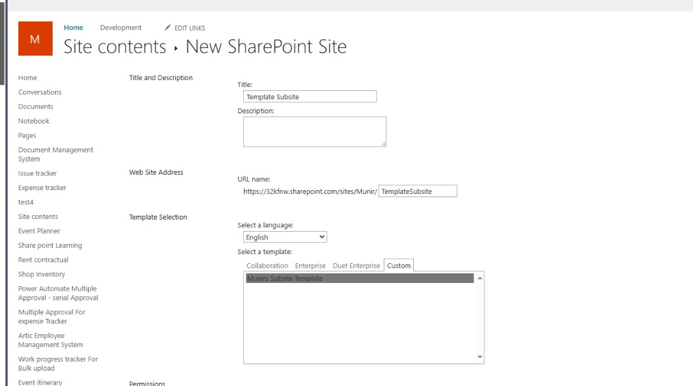
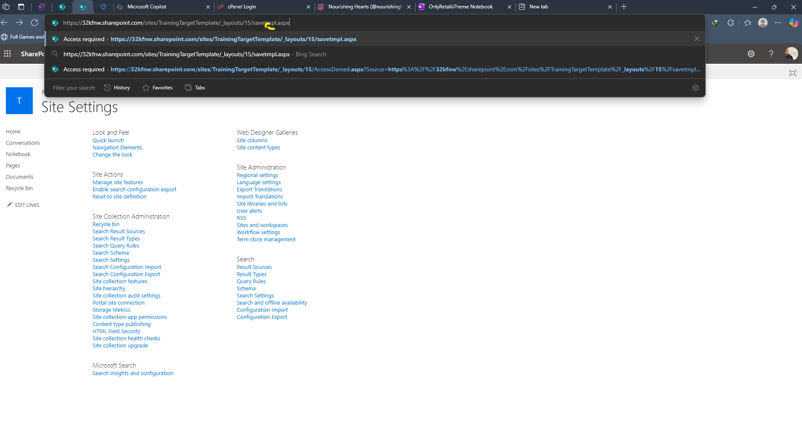
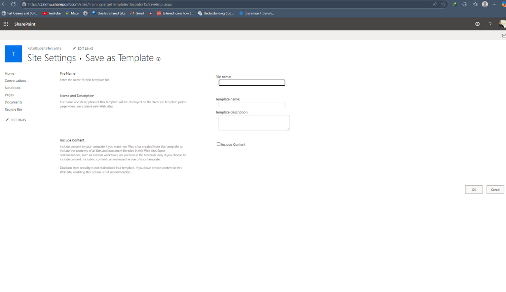

<p align="center">
  
</p>

**PowerShell steps that allow custom scripts on SharePoint Online sites, so a site can be saved as a template and that template applied to a subsite.**

<p>
  
  
  
</p>

## The problem

Modern SharePoint Online sites block custom scripts by default, so **Save site as template** is not available and subsites have to be configured by hand, one at a time. Manual configuration is slow and inconsistent.

## Key features

- Re-enables **Save site as template** on an existing site by lifting `DenyAddAndCustomizePages` with `Set-SPOSite`.
- Prepares the target site the same way so the saved template can be activated under **Solutions** and used to create the subsite.
- The PowerShell steps are repeatable, which replaces manual configuration and cuts down on errors.


```mermaid
flowchart LR
  A[Connect-SPOService<br/>admin center] --> B[Set-SPOSite template site<br/>DenyAddAndCustomizePages = false]
  B --> C[Site Settings →<br/>Save site as template]
  C --> D[Set-SPOSite target site<br/>DenyAddAndCustomizePages = false]
  D --> E[Solutions → activate template<br/>→ create subsite]
```

## How to run

Prerequisites: SharePoint admin rights and the SharePoint Online Management Shell.

```powershell
Install-Module -Name Microsoft.Online.SharePoint.PowerShell

# Connect to the SharePoint admin center
Connect-SPOService -Url https://TenantName-admin.sharepoint.com

# Allow custom scripts on the site you will save as a template
Set-SPOSite -Identity https://TenantName.sharepoint.com/sites/TemplateSiteName -DenyAddAndCustomizePages $false

# Allow custom scripts on the site that will host the new subsite
Set-SPOSite -Identity https://TenantName.sharepoint.com/sites/TargetSubsite -DenyAddAndCustomizePages $false
```

Then:

1. On the template site, go to **Site Settings → Save site as template**.
2. On the target site, go to **Site Settings → Solutions**, activate the template and create the subsite.

Replace `TenantName`, `TemplateSiteName` and `TargetSubsite` with your own values.

## Screenshots






---

Built by [Munir Ali](https://www.linkedin.com/in/munir-ali-7b9607234/) · [Back to portfolio](../README.md)
