# Document Management System (DMS)

## Overview

🚀 A modern, efficient DMS for managing documents with ease. 🚀

##

## Features:
1. **Custom Views**: JSON-based views for Standard, Calendar, Approved By, and Gallery.
2. **Gallery Tile View**: Visually appealing document display.
3. **Enhanced Standard View**: Custom CSS for a refined look.

## Workflows:
1. **Rejected Documents**: Automatically move rejected docs to a separate folder.
2. **Auto-Deletion**: Removes old rejected documents after 7 days.
3. **Approval Workflow**: Streamlined approval process.

## Security:
1. **Custom Permissions**: Secure document handling with custom low-level permissions.

  
## Project Images 
**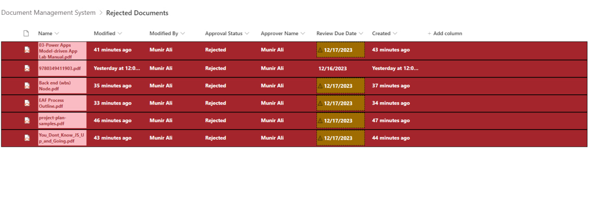**
**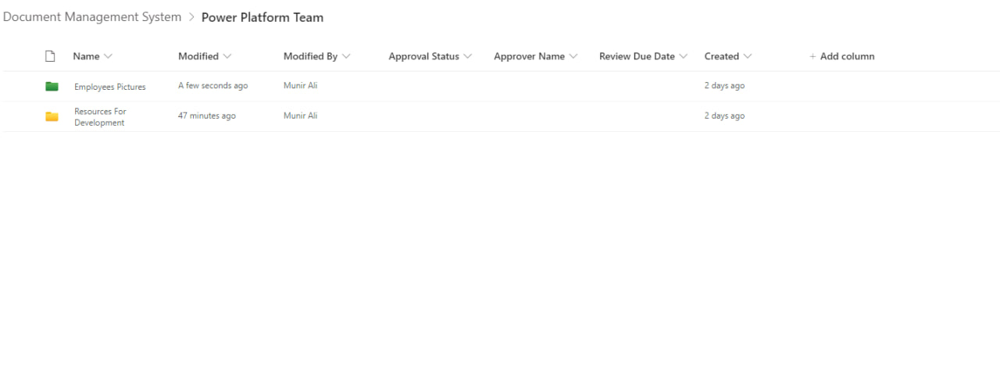**
**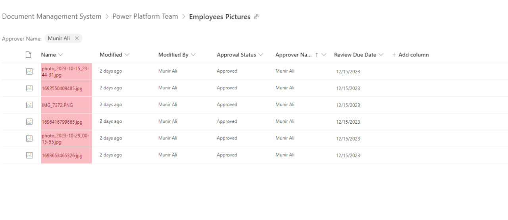**
**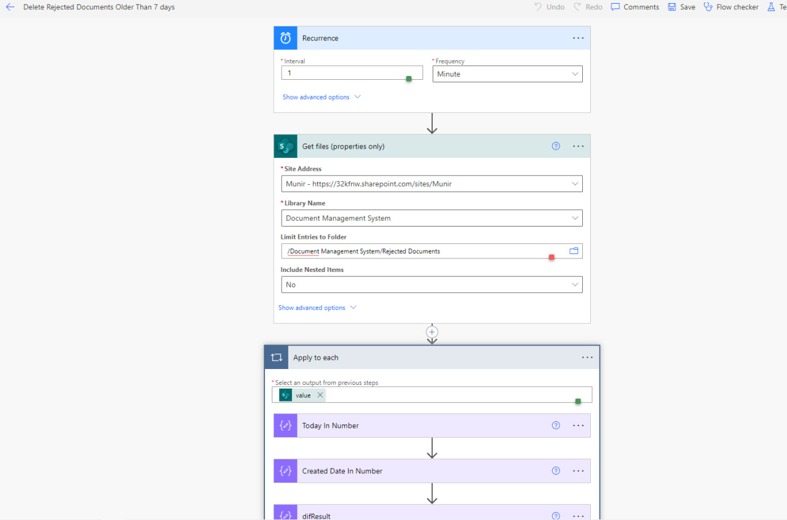**
**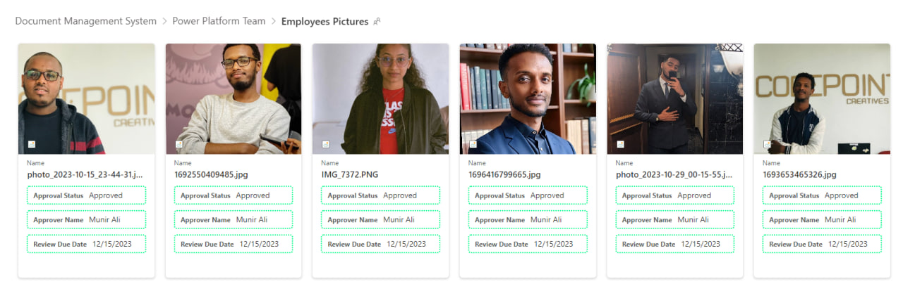**
**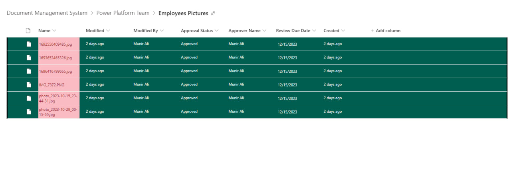**
**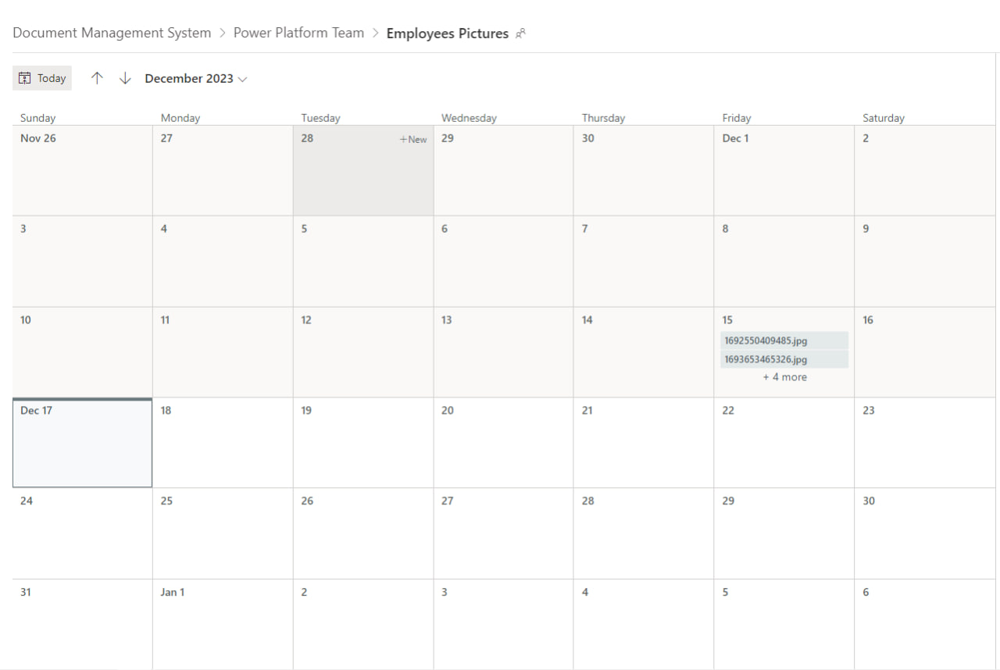**
**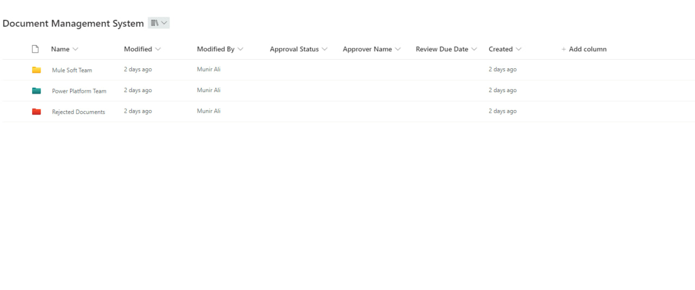**
**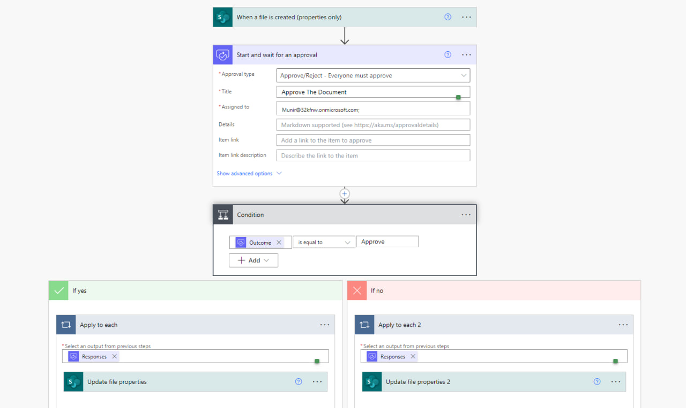**
**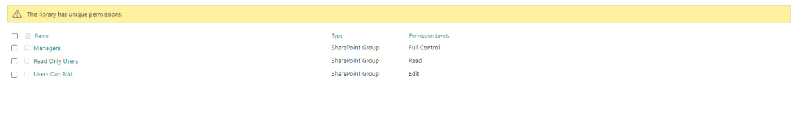**
**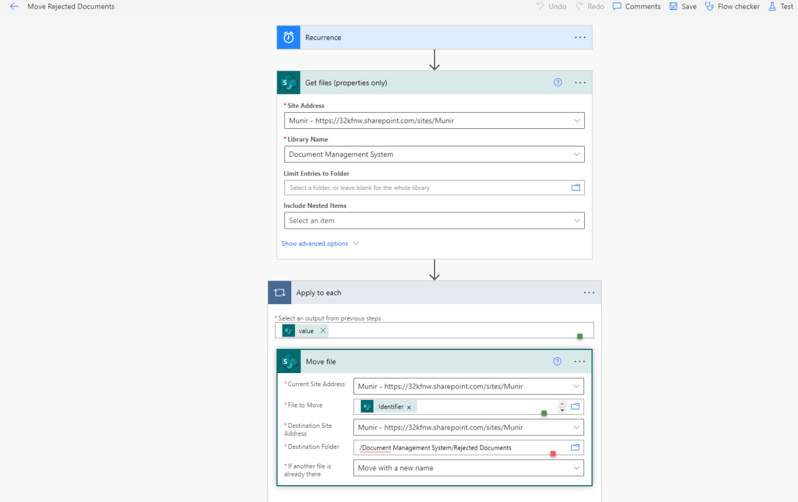**

## Connect with Me:

- LinkedIn: [Munir Ali ](https://www.linkedin.com/in/munir-ali-7b9607234/)

