

  

**A SharePoint document management system with JSON-formatted views, an approval workflow, automatic handling of rejected documents and custom permissions.**

  
  
  
  

## The problem

Shared document libraries get cluttered. Pending, approved and rejected files sit side by side, old rejected documents never get cleaned up, and the default views make it hard to see which files have been approved.

## Key features

- **Custom views.** JSON-formatted Standard, Calendar, Approved By and Gallery views.
- **Gallery tile view** for a visual document layout.
- **Styled standard view** with custom formatting.
- **Approval workflow** for submitted documents.
- **Rejected-document handling.** Rejected files are moved to a separate folder automatically.
- **Auto-clean-up.** Rejected documents older than 7 days are deleted.
- **Custom permissions** at a fine-grained level for secure document handling.

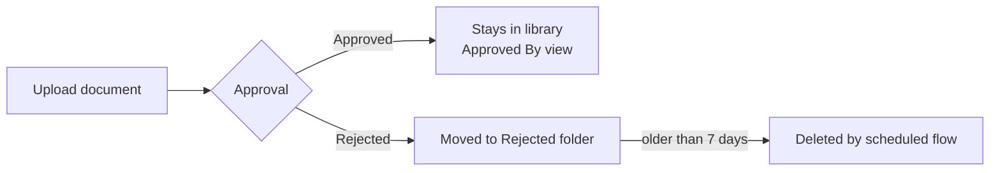
```mermaid
flowchart LR
  U[Upload document] --> AP{Approval}
  AP -->|Approved| LIB[Stays in library<br/>Approved By view]
  AP -->|Rejected| RJ[Moved to Rejected folder]
  RJ -->|older than 7 days| DEL[Deleted by scheduled flow]
```

## Screenshots

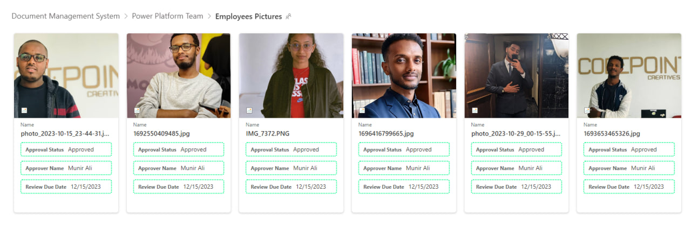
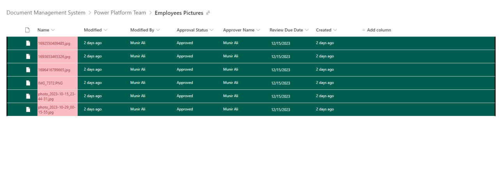
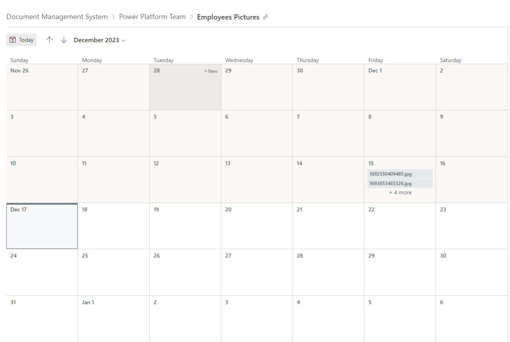
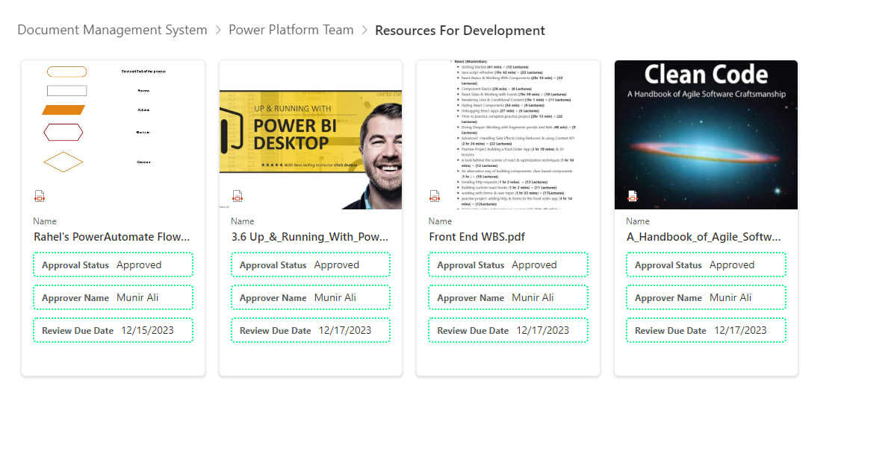
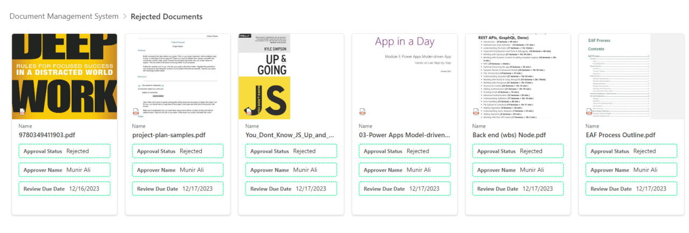
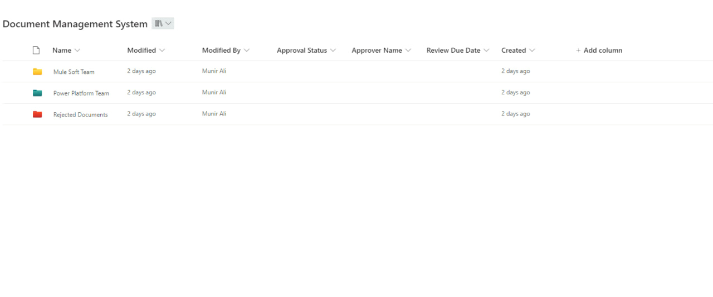
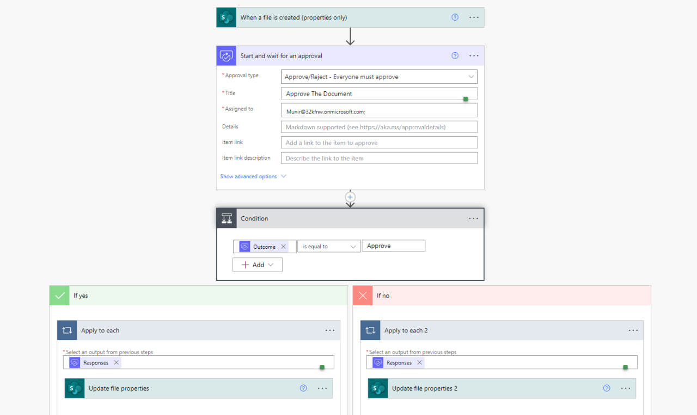
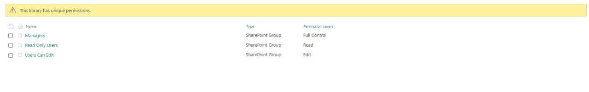
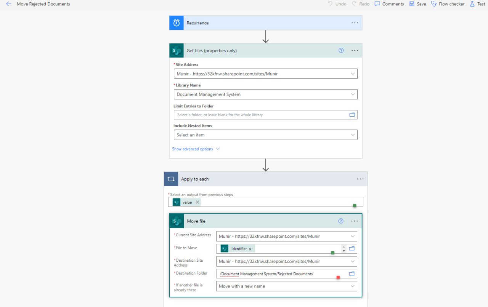
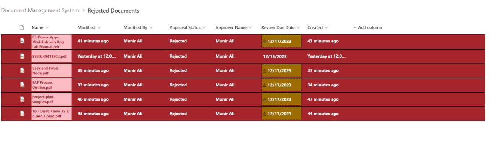
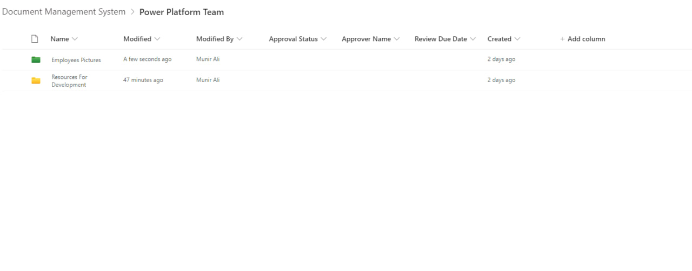
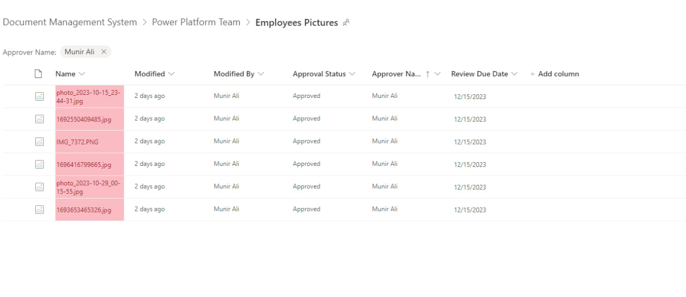
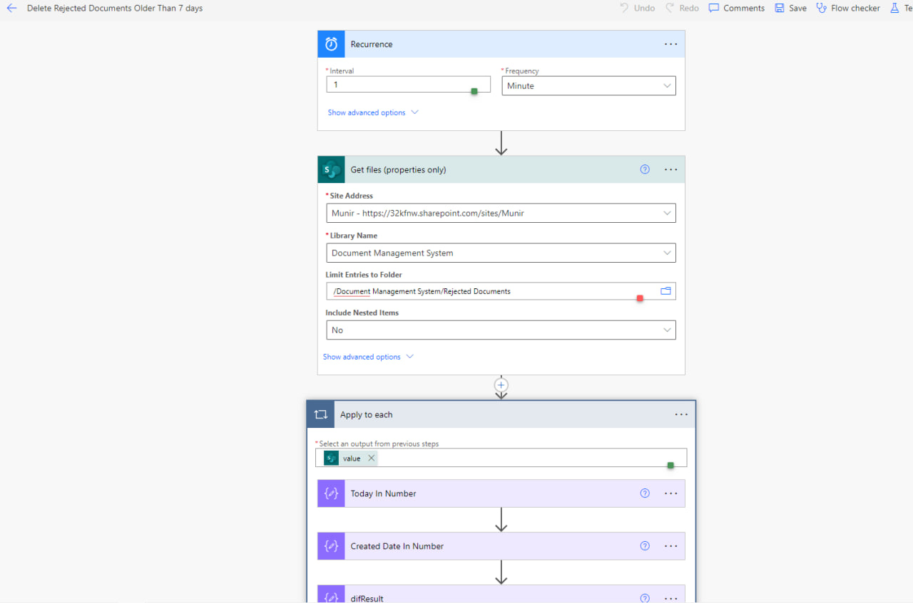

---

Built by [Munir Ali](https://www.linkedin.com/in/munir-ali-7b9607234/) · [Back to portfolio](../README.md)
