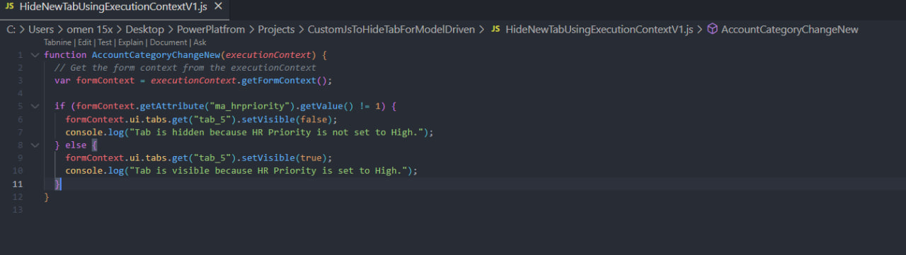
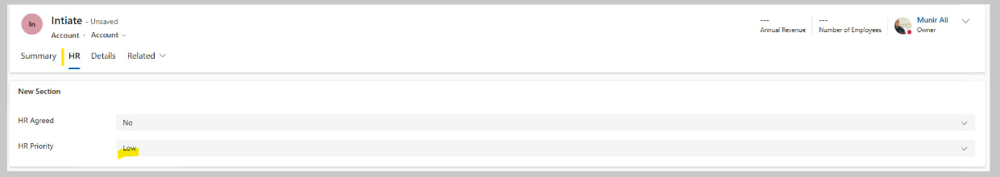
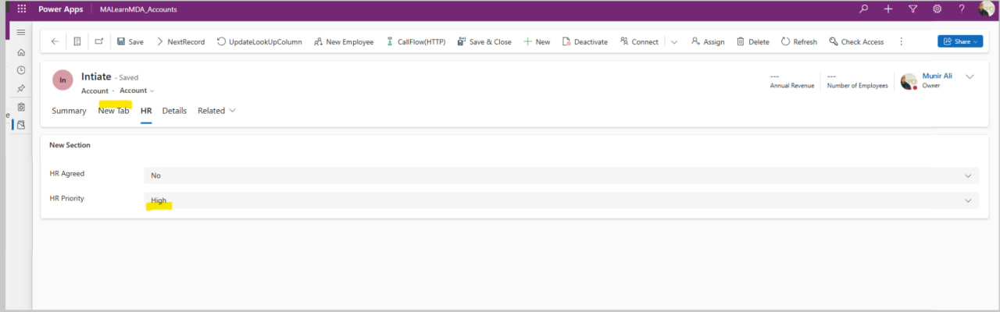
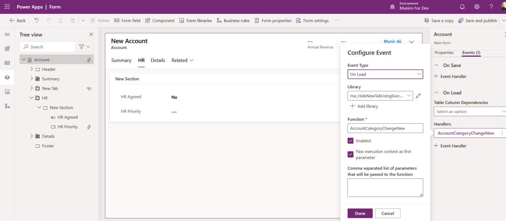
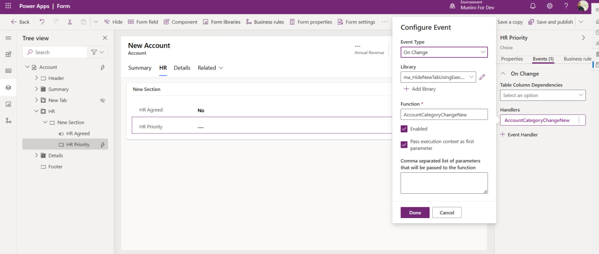

# Dynamically Hide "New Tab" Based on HR Priority in Model-Driven-App

This project demonstrates the use of **JavaScript with execution context** in a model-driven Power Apps form to dynamically
hide or show a tab based on the value of the **HR Priority** field. It replaces the **deprecated `Xrm` methods** with modern practices
to ensure compatibility and maintainability.

---

## Overview

The functionality is implemented as follows:

1. **Objective**:  
   Dynamically control the visibility of the **"New Tab"** based on the **HR Priority** field:
   - **Hide the tab** if HR Priority = "High".
   - **Show the tab** for all other values.

2. **Implementation Highlights**:
   - Created a **JavaScript library** to handle the logic.
   - Leveraged the **execution context** for modern Power Apps practices.
   - Attached the script to the **OnChange** event of the HR Priority field for real-time updates.

3. **Skills & Tools Used**:
   - **JavaScript** for logic implementation.
   - **Power Apps Form Designer** for customization.
   - Debugging with browser tools via `console.log`.

## Screenshots
****
****
****
****
****

## Connect with Me:
- LinkedIn: [Munir Ali ](https://www.linkedin.com/in/munir-ali-7b9607234/)
