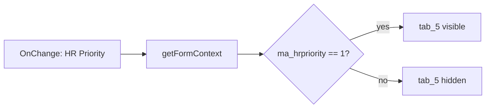
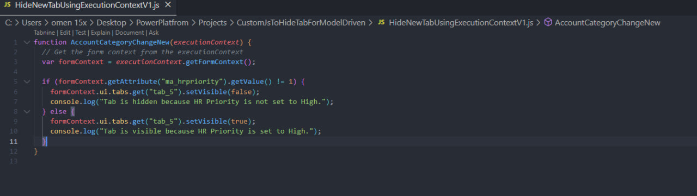
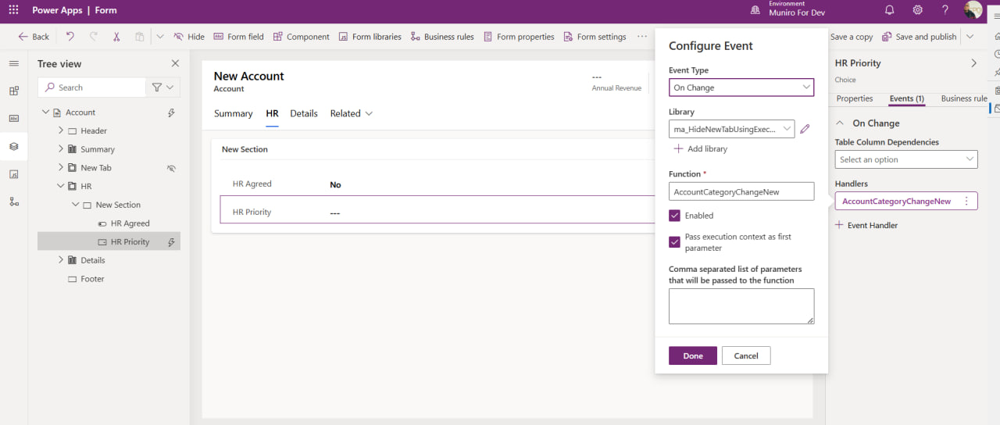
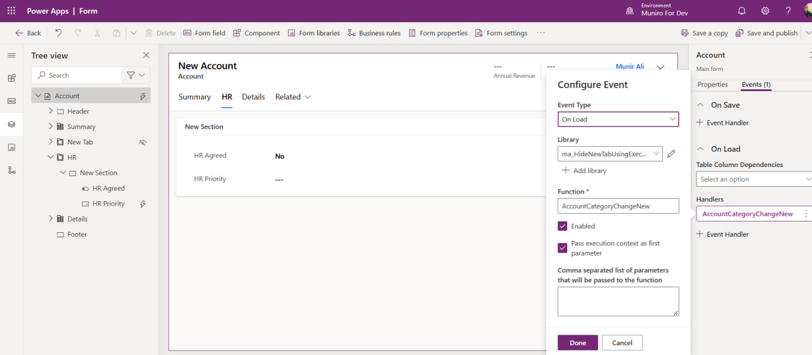
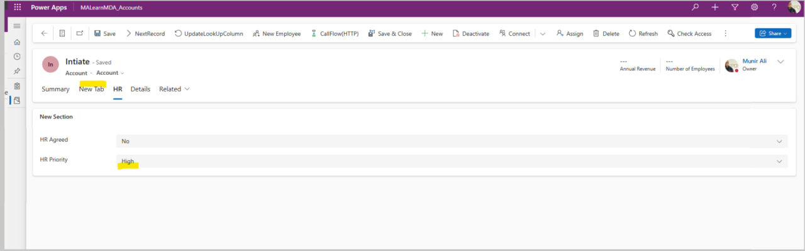
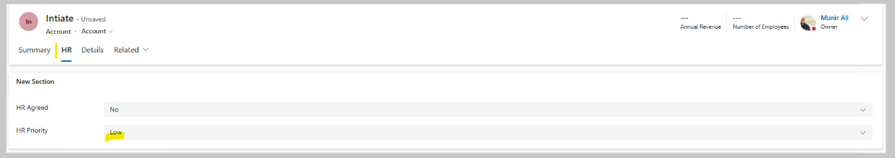

  

**A model-driven form script that shows or hides a tab when the HR Priority field changes. It uses the execution context instead of the deprecated global `Xrm.Page`.**

  
  
  
  

## The problem

A form tab should only appear when it's relevant. Older scripts did this with `Xrm.Page`, which is deprecated, so they break or become hard to maintain.

## How it works

[`HideNewTabUsingExecutionContextV1.js`](HideNewTabUsingExecutionContextV1.js) exposes `AccountCategoryChangeNew(executionContext)`:

- Gets the form context from `executionContext.getFormContext()`.
- Reads the `ma_hrpriority` choice column.
- Shows tab `tab_5` when the value is `1` (High) and hides it for any other value.
- Logs each decision with `console.log` for debugging in browser dev tools.

```mermaid
flowchart LR
  E[OnChange: HR Priority] --> F[getFormContext]
  F --> Q{ma_hrpriority == 1?}
  Q -->|yes| S[tab_5 visible]
  Q -->|no| H[tab_5 hidden]
```

## How to deploy

1. Add the `.js` file as a JavaScript web resource in your solution.
2. Open the form in the form designer and add the web resource as a form library.
3. On the **HR Priority** column's **OnChange** event, register `AccountCategoryChangeNew` and tick **Pass execution context as first parameter**.
4. Save and publish.

## Screenshots

---

Built by [Munir Ali](https://www.linkedin.com/in/munir-ali-7b9607234/) · [Back to portfolio](../README.md)
