# 🐾 Paw & Heart Animal Shelter Management

Welcome to the **Paw & Heart Animal Shelter Management** repository! This project demonstrates an innovative solution built using **Microsoft Power Platform** to streamline the operations of **Paw & Heart**, an animal rescue charity. The solution focuses on simplifying animal management, fostering workflows, and providing actionable insights for better decision-making.

---

## 🎯 Overview

This solution was created as part of the **Power Up Challenge** to address the operational challenges faced by animal shelters. By leveraging the **Microsoft Power Platform**, the solution provides:

- 🗃️ **Centralized Data Management**: Maintain records for shelters, animals, and foster families.
- 🔄 **Streamlined Workflows**: Simplify animal handling and fostering processes.
- 📊 **Actionable Insights**: Promote fostering and measure shelter accomplishments.

---

## 🌟 Features

| **Component**      | **Description**                                                                                              |
|---------------------|------------------------------------------------------------------------------------------------------------|
| **Dataverse**       | Centralized tables holding data for animals, shelters, and foster families with defined relationships.      |
| **Model-Driven App**| A robust app for shelter staff to manage animal records and workflows efficiently.                          |
| **Canvas App**      | A user-friendly app designed for foster families to browse and claim animals for fostering.                 |
| **Power Automate**  | Automated workflows to notify foster families about animal updates and pickup details.                      |
| **Power BI**        | Interactive dashboards for actionable insights into shelter performance and fostering trends.               |

---

## 🏗️ Solution Details

### **1. Dataverse**
- **Tables Created:**
  - 🐶 **Animals**
  - 🏠 **Shelters**
  - 👨‍👩‍👧‍👦 **Foster Families**
- **Relationships:**
  - **Animals → Shelters**: Many-to-One
  - **Animals → Foster Families**: Many-to-One
  - **Foster Families → Shelters**: Many-to-One

- **Data Management:** Imported datasets with a focus on maintaining data integrity and proper mapping.

---

### **2. Model-Driven App**
- **Purpose:** Designed for shelter staff to efficiently manage animals and workflows.
- **Key Features:**
  - 🗂️ Sort and filter animals by type or status.
  - 👀 Custom views for adopted animals and those ready for fostering.
  - ⚙️ **Business Rule:** Prevent marking animals as "Ready to Foster" unless all medical conditions are resolved.

---

### **3. Canvas App**
- **Purpose:** Created for foster families to find animals to foster.
- **Key Features:**
  - 📍 Select a shelter and browse animals available for fostering.
  - 🖱️ Update animal status to "Claimed for Foster" with a single tap.

---

### **4. Power Automate**
- **Purpose:** Automates communication between shelters and foster families.
- **Key Feature:**
  - 📧 Triggered email notifications with detailed animal information and pickup arrangements.

---

### **5. Power BI**
- **Purpose:** Provides actionable insights for the shelter's marketing and operations teams.
- **Key Features:**
  - 📈 **Metrics:** Tracks arrivals, fostering activity, and trends over the last three months.
  - 🐾 **Highlights:** Displays the most rescued and fostered animal types.

---

## 📈 Benefits

- **Efficiency:** Simplifies shelter staff workflows by centralizing data and automating communication.
- **Transparency:** Provides foster families with an easy way to browse and claim animals.
- **Insights:** Empowers the marketing team with data to promote fostering and track accomplishments.

---

## 🌐 Technologies Used

- 🗄️ **Microsoft Dataverse**
- 📱 **Model-Driven App**
- 🖼️ **Canvas App**
- 🔄 **Power Automate**
- 📊 **Power BI**

---
## Screenshots
**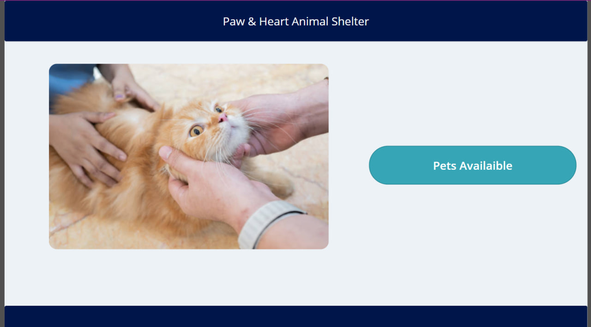**
**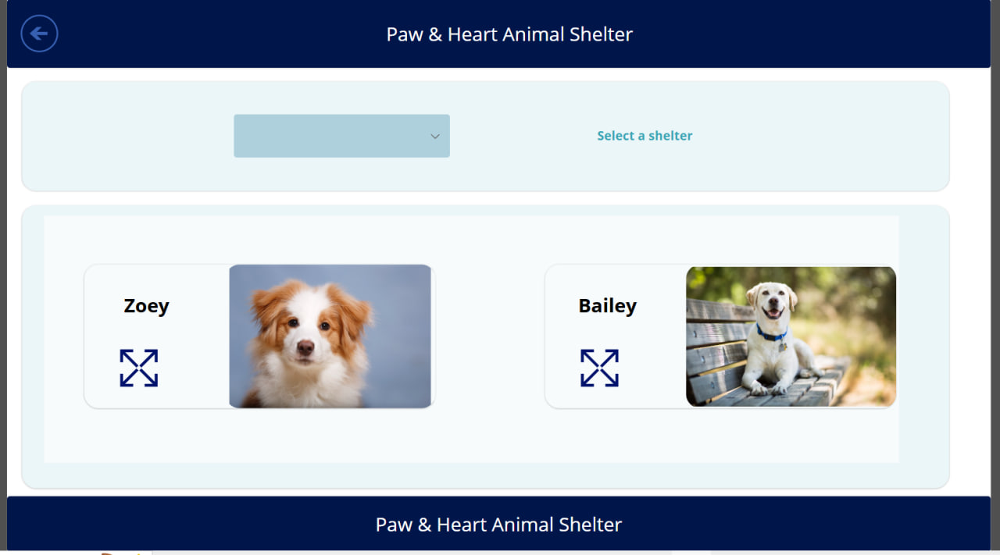**
**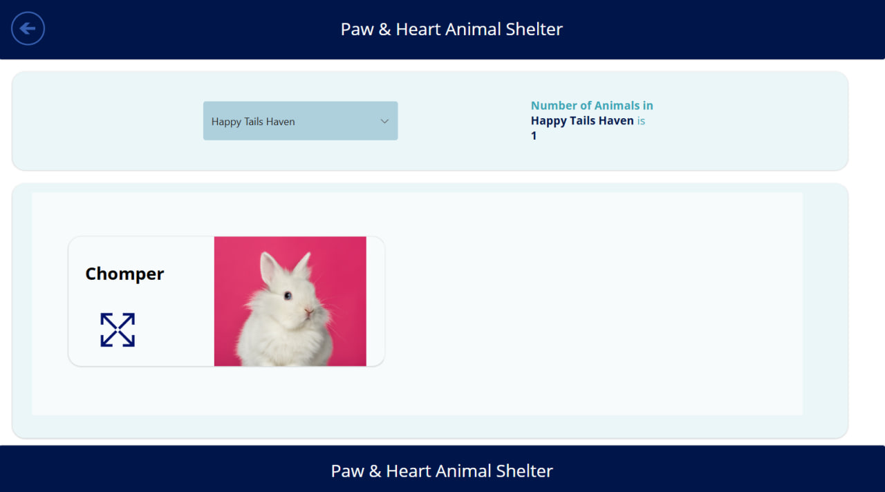**
**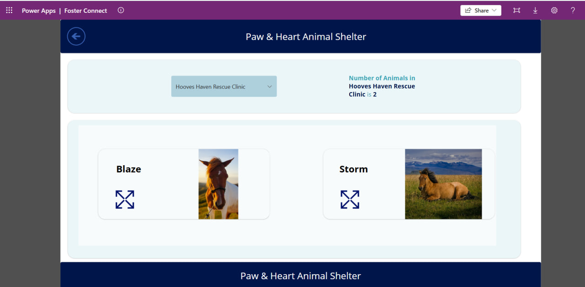**
**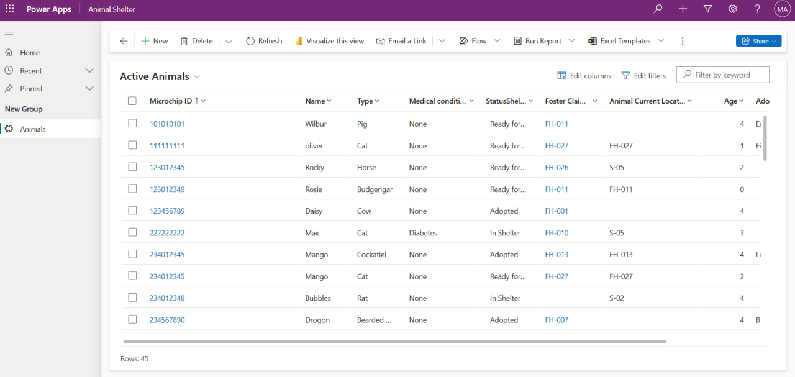**
**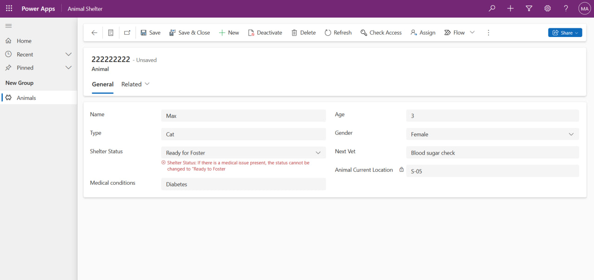**
**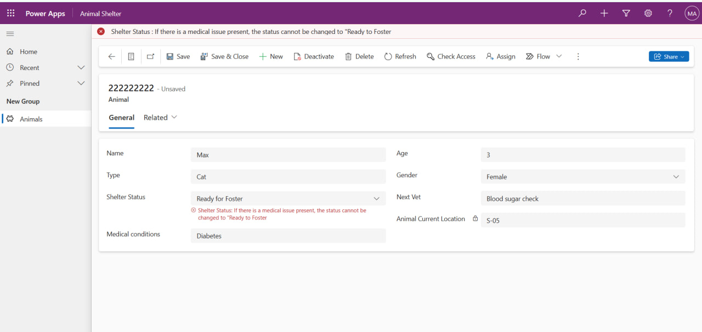**
**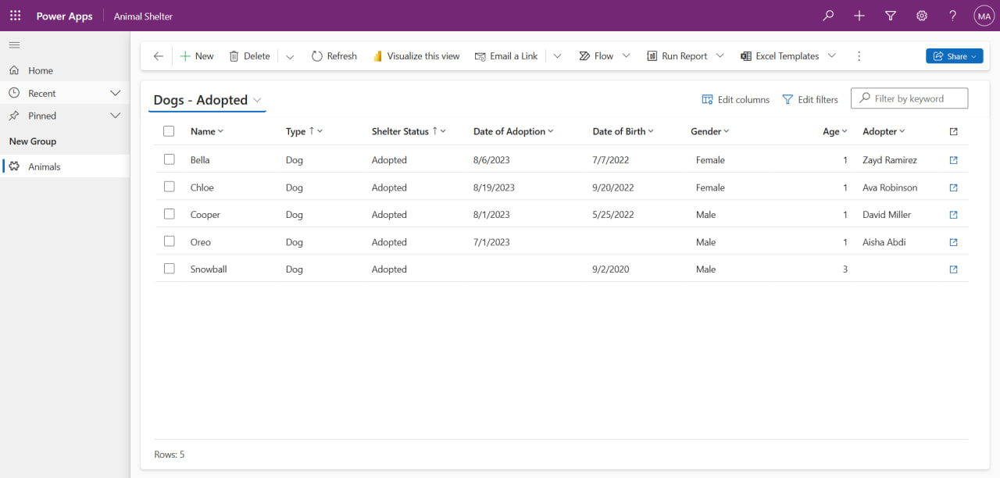**
**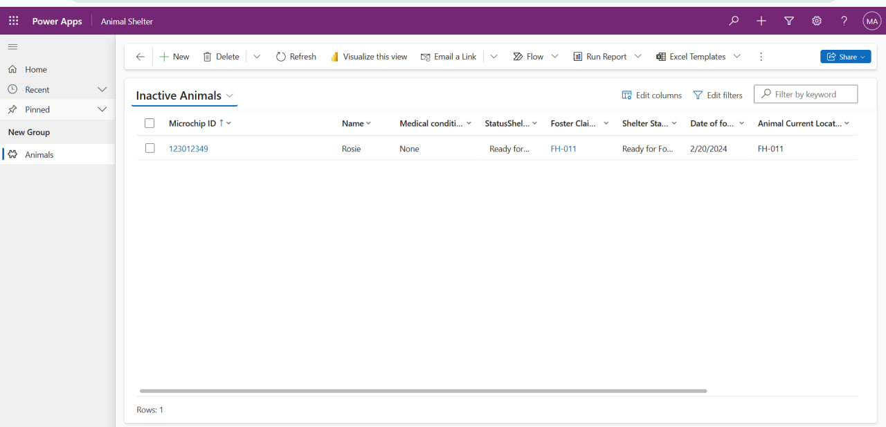**
**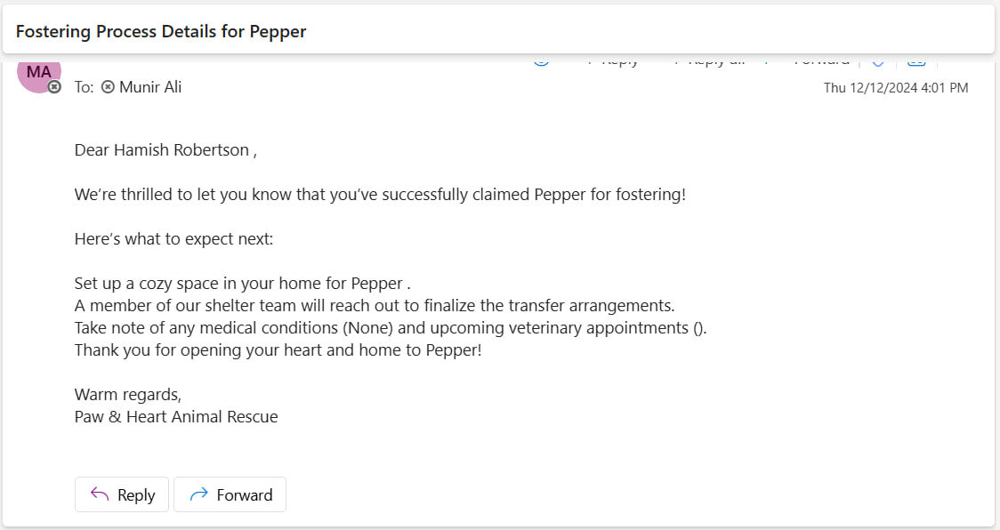**
**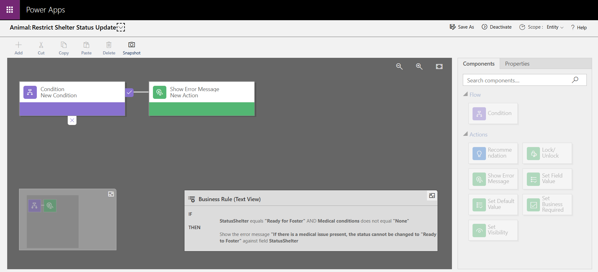**

---

## Connect with Me:
- LinkedIn: [Munir Ali ](https://www.linkedin.com/in/munir-ali-7b9607234/)

