

  

**An end-to-end Power Platform solution for Paw & Heart, the animal rescue charity in the Power Up Challenge scenario: Dataverse data, a staff app, a foster-family app, automated emails and Power BI reporting.**

  
  
  
  
  

## The problem

A shelter has to track animals across several shelters, match them with foster families and keep those families informed. Without a shared system that work is manual, and there is no clear view of how fostering is going.

## Key features

- **Dataverse model.** Animals, Shelters and Foster Families tables with many-to-one relationships (Animal → Shelter, Animal → Foster Family, Foster Family → Shelter). Imported datasets are mapped into these tables.
- **Model-driven app for staff.** Sort and filter animals by type or status, with views for adopted animals and animals ready to foster.
- **Business rule.** An animal cannot be marked *Ready to Foster* until all of its medical conditions are resolved.
- **Canvas app for foster families.** Pick a shelter, browse animals available to foster and claim one with a single tap (status becomes *Claimed for Foster*).
- **Power Automate.** Emails foster families the animal's details and pickup arrangements.
- **Power BI.** Arrivals, fostering activity and trends over the last three months, plus the most rescued and most fostered animal types.

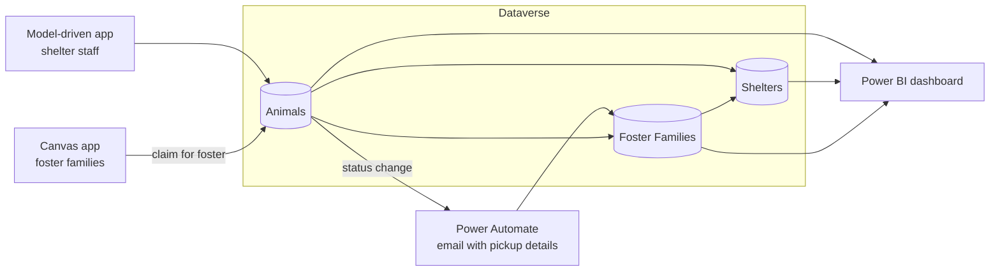
```mermaid
flowchart LR
  subgraph Dataverse
    SH[(Shelters)]
    AN[(Animals)]
    FF[(Foster Families)]
  end
  STAFF[Model-driven app<br/>shelter staff] --> AN
  FOST[Canvas app<br/>foster families] -->|claim for foster| AN
  AN -->|status change| FLOW[Power Automate<br/>email with pickup details] --> FF
  AN & SH & FF --> BI[Power BI dashboard]
  AN --> SH
  AN --> FF
  FF --> SH
```

## Screenshots

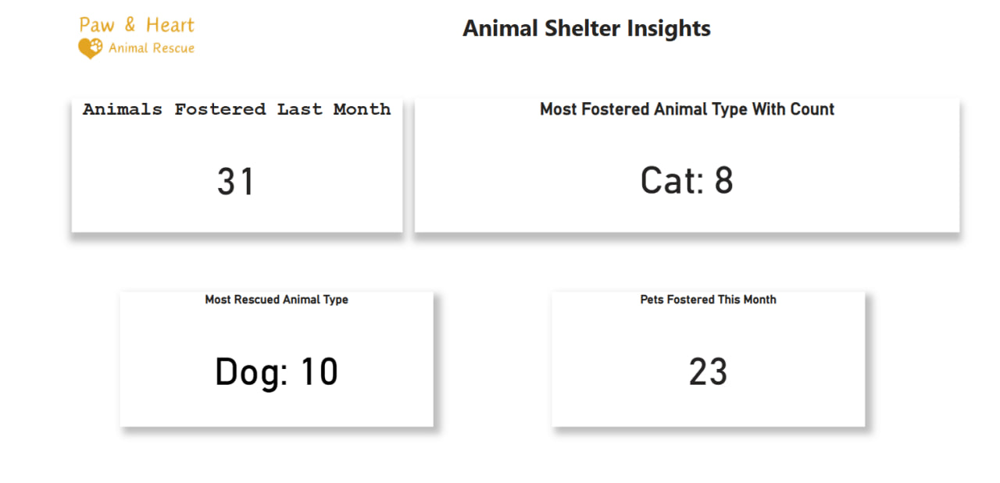
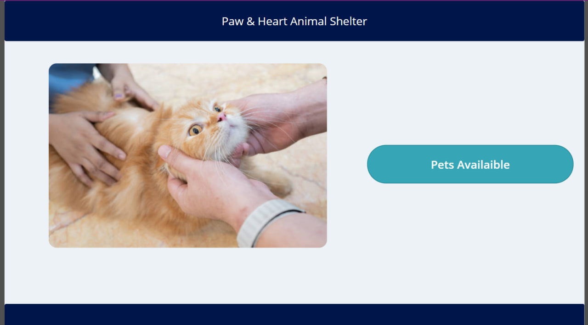
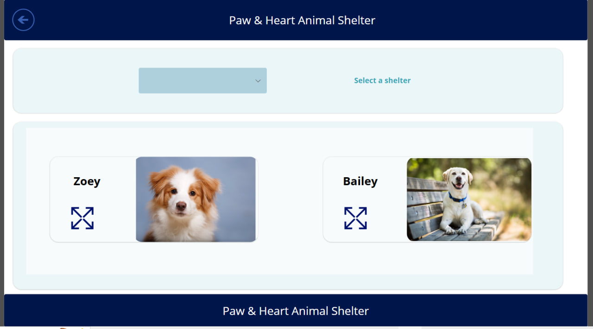
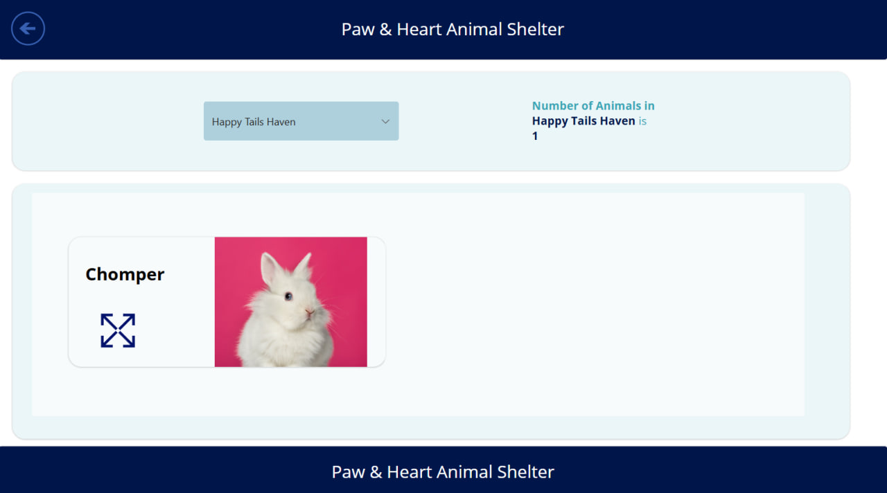
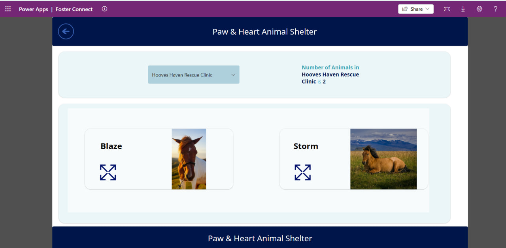
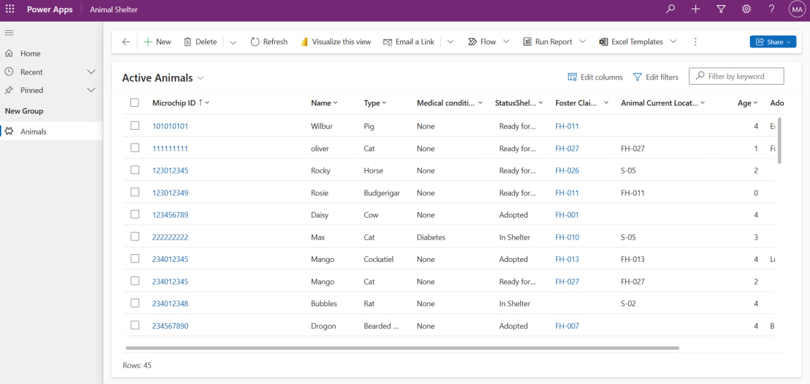
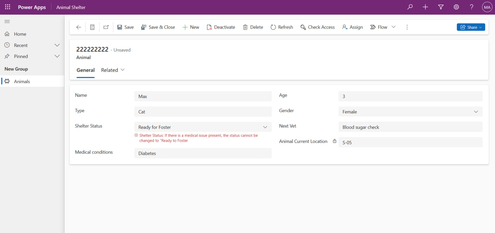
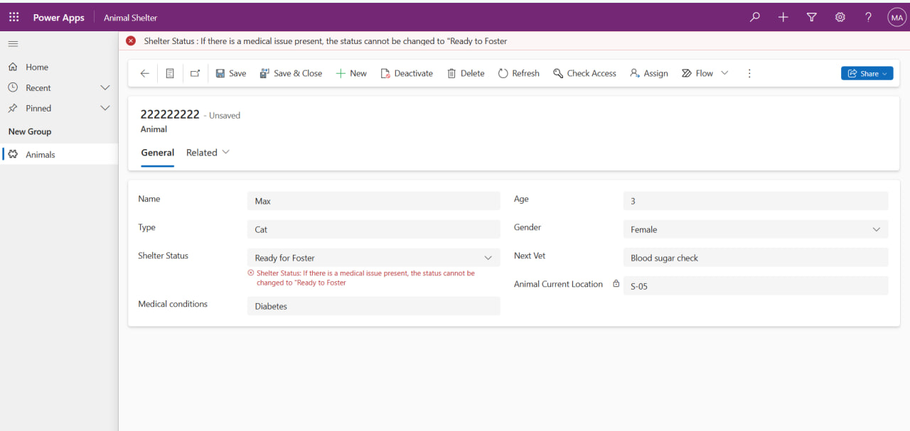
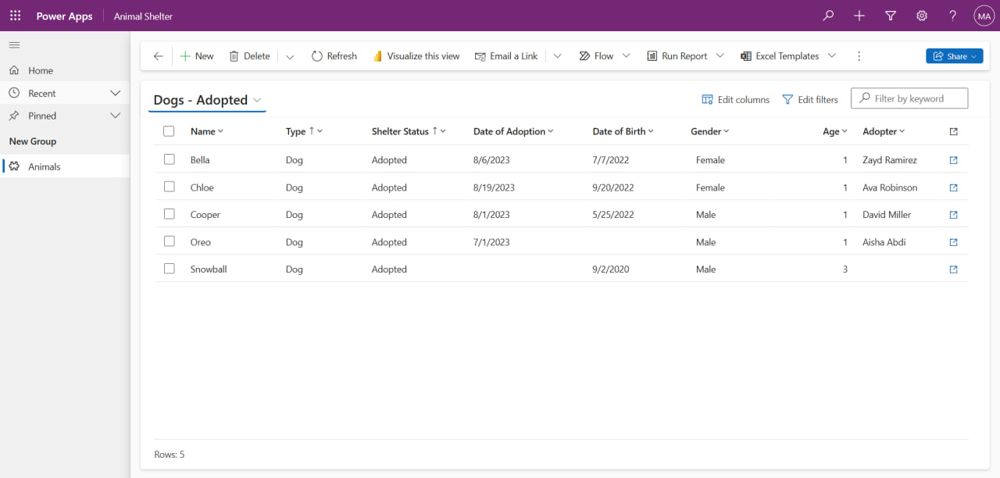
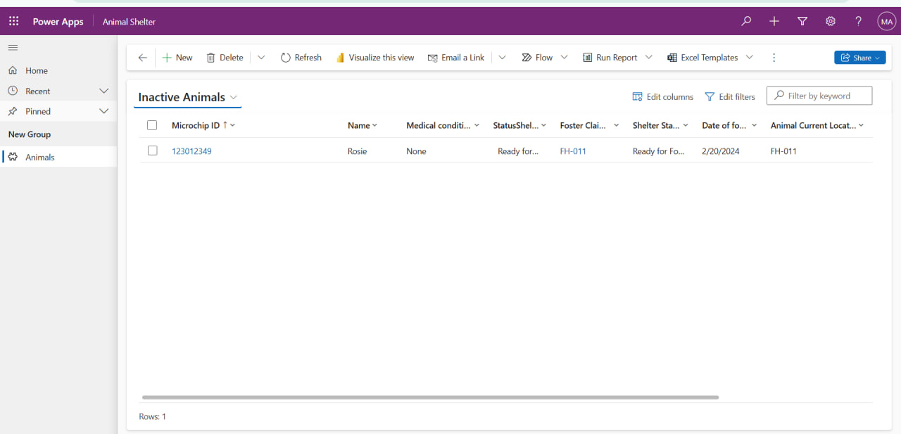
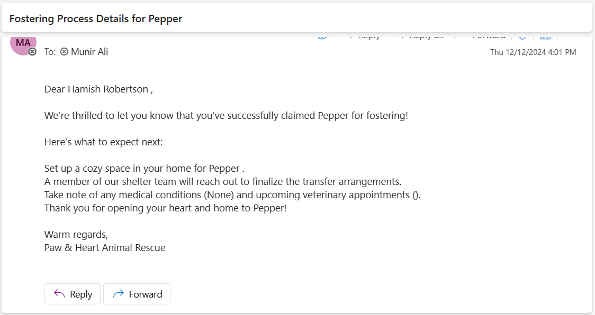
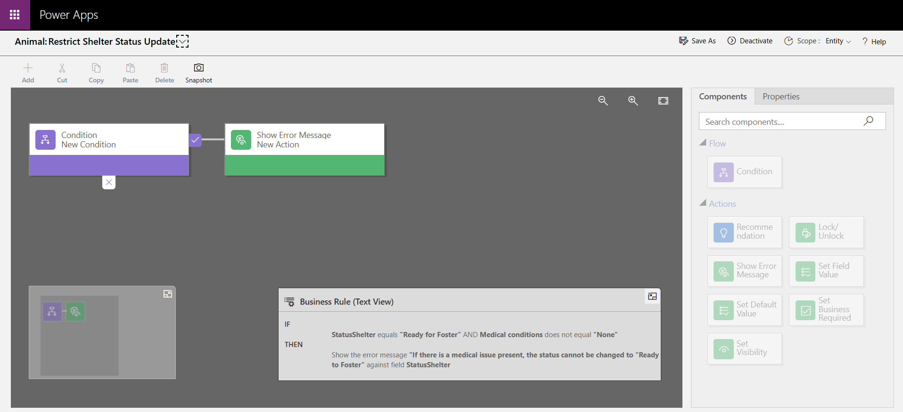

---

Built by [Munir Ali](https://www.linkedin.com/in/munir-ali-7b9607234/) · [Back to portfolio](../README.md)
