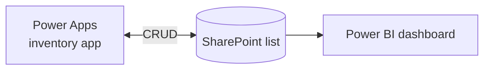
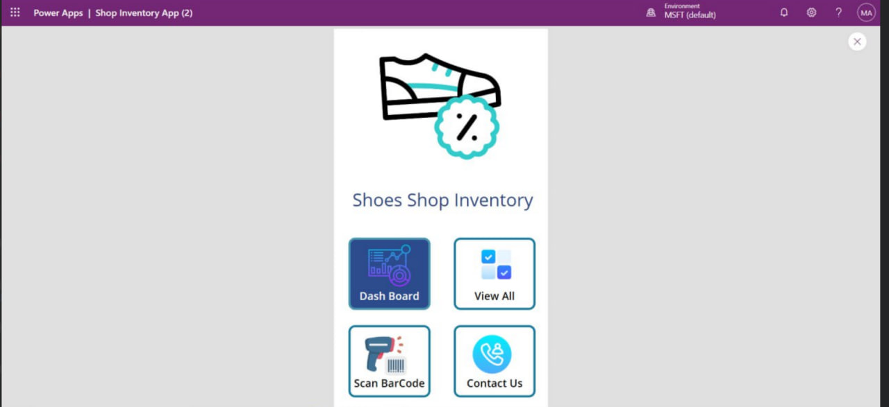
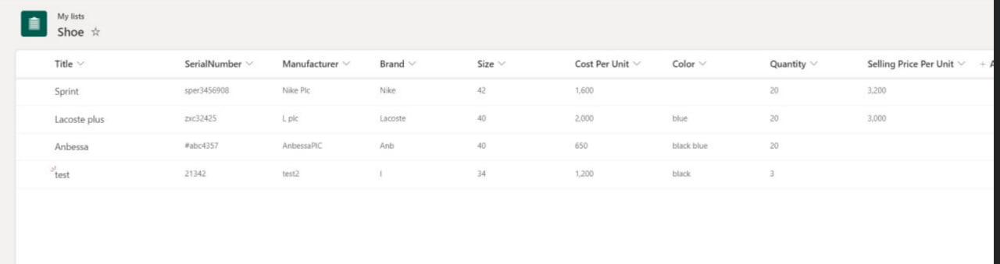
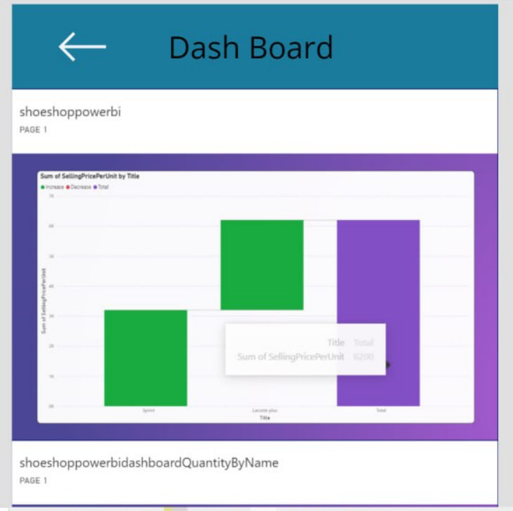
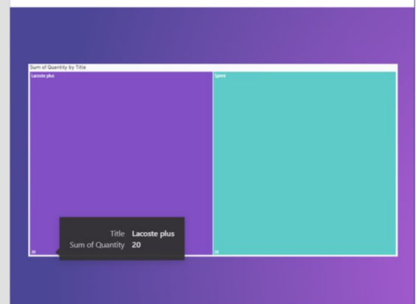
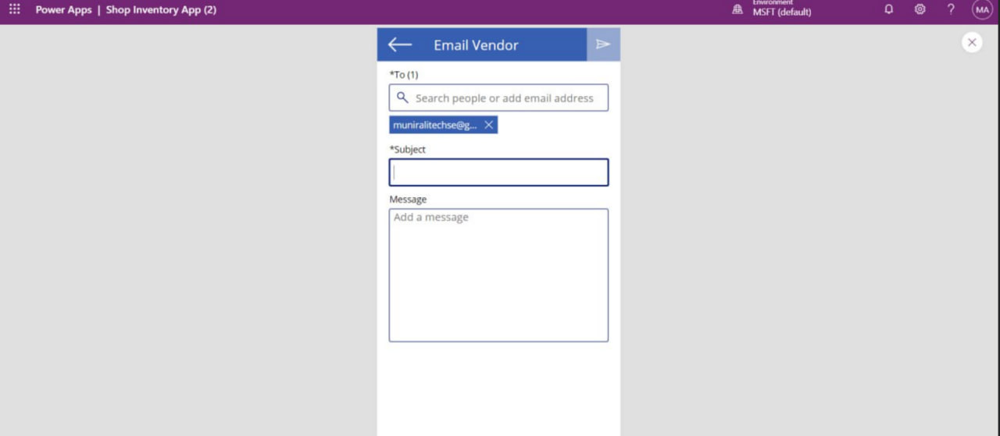
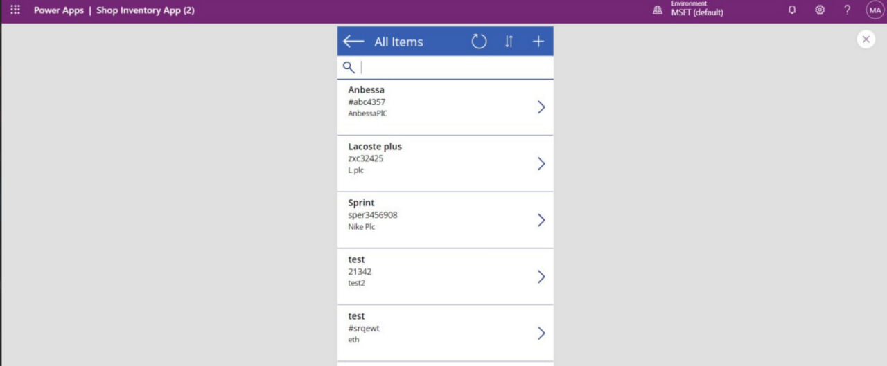
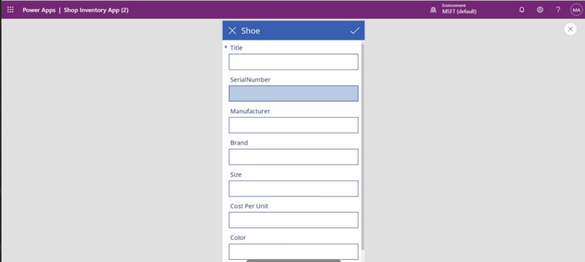

  

**A Power Apps inventory app for a shoe shop, backed by SharePoint, with a Power BI dashboard for stock and sales trends.**

  
  
  

## The problem

Small retailers need a simple way to keep stock records accurate and to see how inventory is performing, without buying a full inventory system.

## Key features

- **Inventory management.** Add, view, update and delete shoe inventory items.
- **Stock tracking** with SharePoint as the data source.
- **Power BI dashboard** showing sales and stock trends.
- **Contact support** screen so users can reach support directly.
- A clean, simple interface for everyday use.

```mermaid
flowchart LR
  APP[Power Apps<br/>inventory app] <-->|CRUD| SP[(SharePoint list)]
  SP --> BI[Power BI dashboard]
```

## Screenshots

---

Built by [Munir Ali](https://www.linkedin.com/in/munir-ali-7b9607234/) · [Back to portfolio](../README.md)
