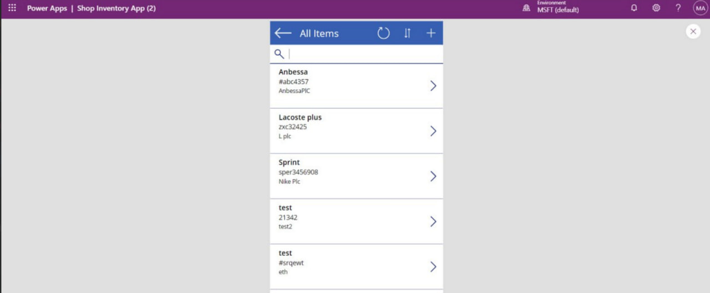

# 👟 Shoes Shop App
The Shoes Shop Inventory App is a robust and user-friendly application built using Microsoft Power Apps. 
It enables end-users to efficiently manage shoe inventory, track stock levels, and analyze performance through an interactive dashboard powered by Power BI.

## 🚀 **Features**

-🚀**Inventory Management**: End-users can easily add, view, update, and delete inventory items with a simple interface.
-🚀**Interactive Dashboard**: Analyze inventory performance with Power BI integration for insights into sales and stock trends.
-🚀**Barcode Scanning**: Quickly add or retrieve inventory details using the integrated barcode scanner.
-🚀**User-Friendly Interface**: Simple and clean design ensures a smooth user experience.
-🚀**Contact Support**: Direct access to support for user inquiries.

## 🛠️ Technologies Used

-**Microsoft Power Apps**: For building the application interface and logic.
-**Power BI**: For generating dynamic dashboards and visualizations.
-**SharePoint**: As the backend data source for inventory storage.

## 📸 Screenshots
****
****
****
****
****
****
****

## Connect with Me:
- LinkedIn: [Munir Ali ](https://www.linkedin.com/in/munir-ali-7b9607234/)

