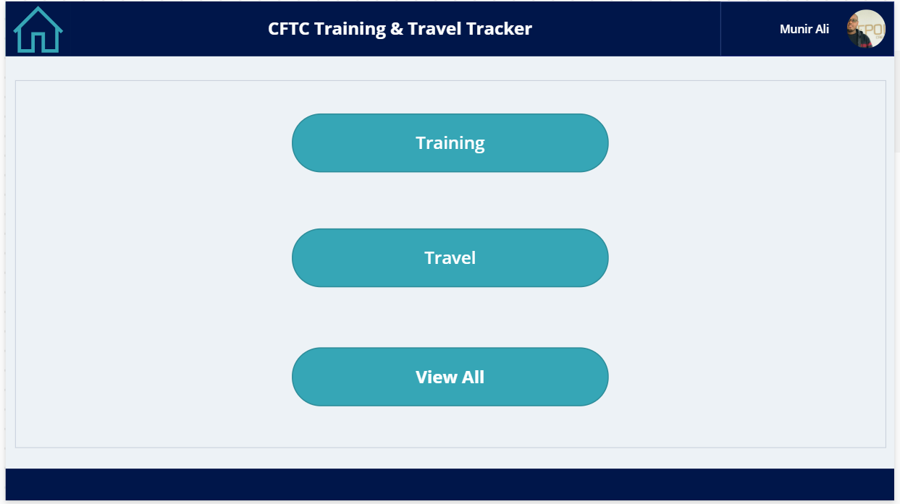
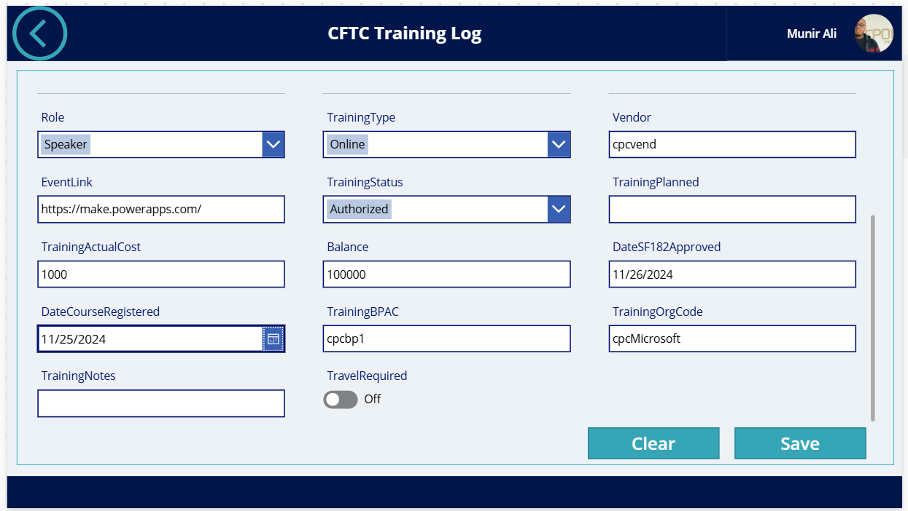
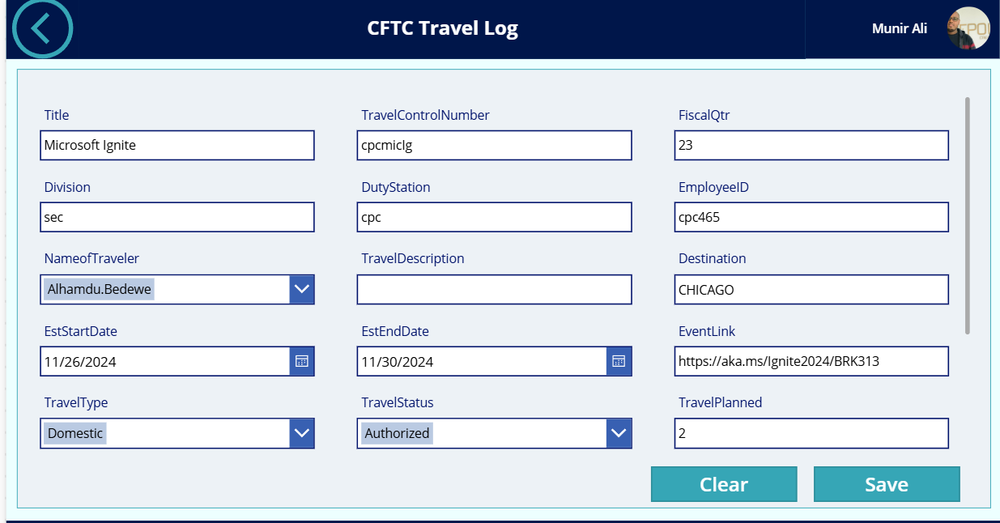
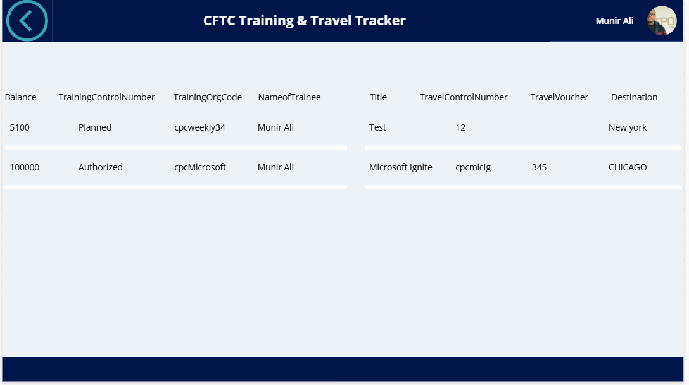

  

**A responsive canvas app for logging and managing an organisation's training sessions and travel plans.**

  
  
  

## The problem

Training and travel records often end up spread across emails and spreadsheets, which makes them slow to enter and hard to track.

## Key features

- **Training and travel logs.** Record and manage training sessions and travel plans in one place.
- **Responsive layout** that works on both desktop and mobile.
- **Simpler data entry** for everyone who logs a session or trip.

## Screenshots

---

Built by [Munir Ali](https://www.linkedin.com/in/munir-ali-7b9607234/) · [Back to portfolio](../README.md)
