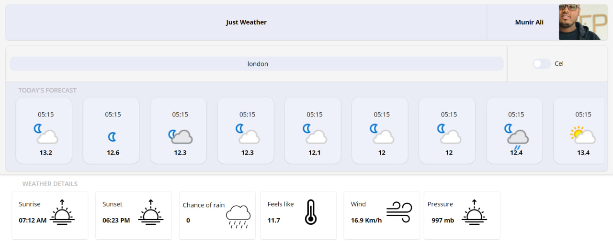

# Weather API Project

## Overview
A Power Apps-based Weather API project with a custom connector that provides seamless weather data retrieval.

## Features:
1. **Dynamic Temperature Conversion**: Easily switch between Celsius and Fahrenheit, affecting both current weather details and forecast data.
2. **Custom Connector**: Utilizes a properly configured custom connector with a secure `GetWeatherAndForecast` endpoint, incorporating API tokenization for authentication.
3. **Search Integration**: Displays results based on user input in the search bar, reflecting the selected temperature toggle.

## Screenshots

### User Interface
****

### Custom Connector Setup
*Followed by images of the custom connector configuration and API setup.*
