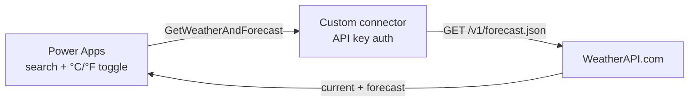
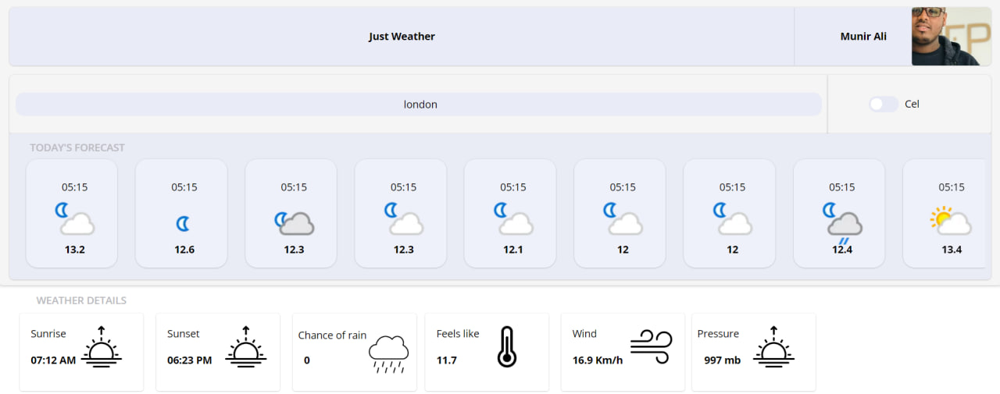
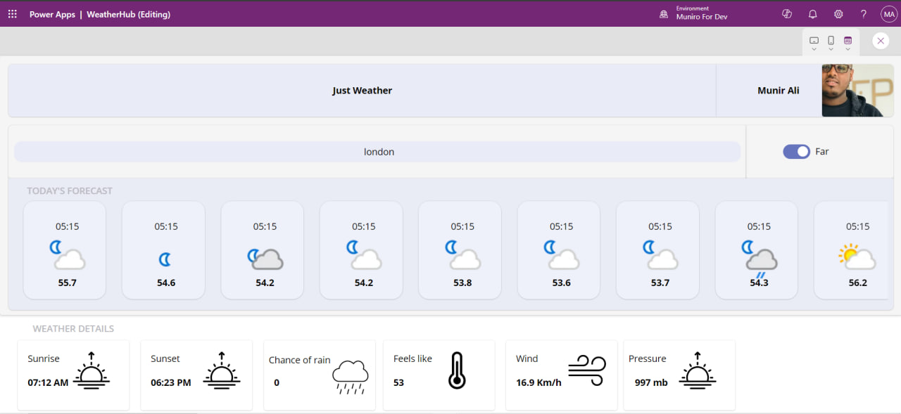
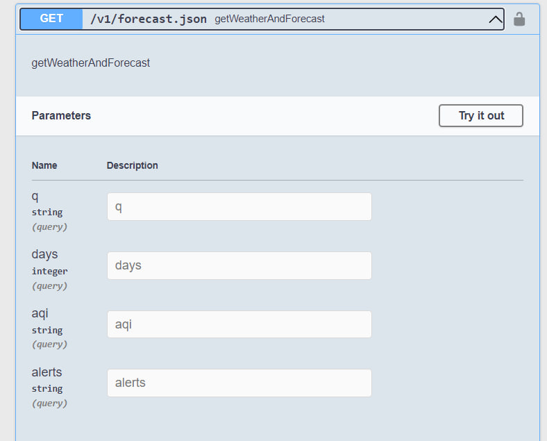
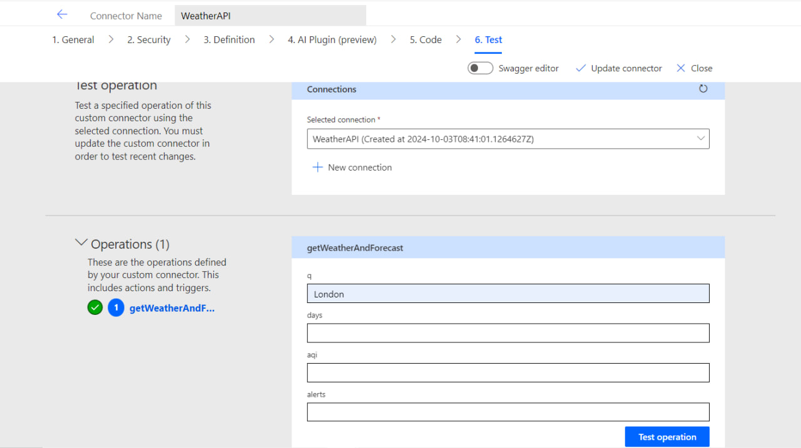
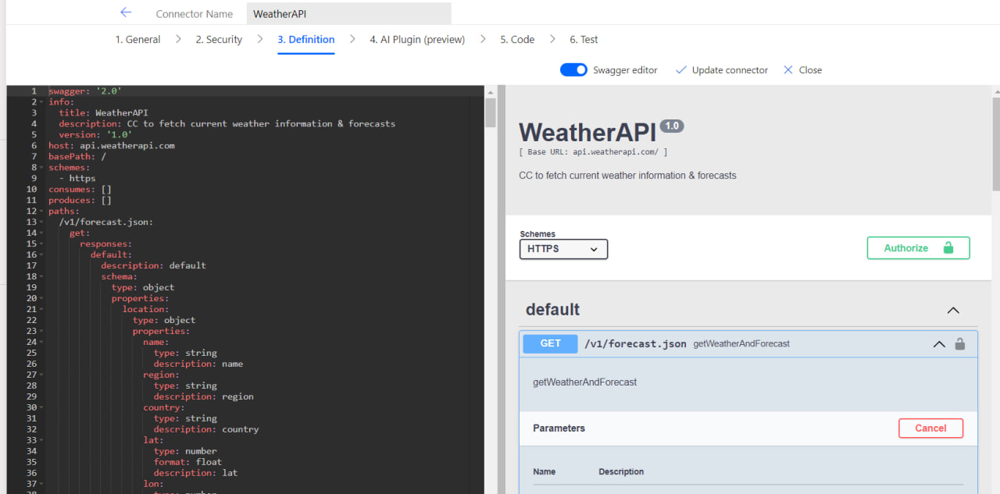
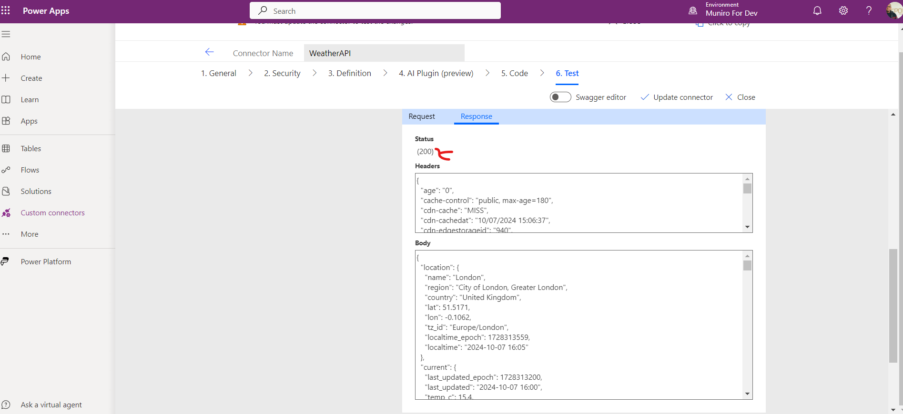

  

**A Power Apps weather app that gets current conditions and forecasts through a custom connector, with a Celsius/Fahrenheit toggle.**

  
  
  
  

## The problem

Power Apps has no built-in connector for many public APIs. A custom connector lets an app call the API securely and reuse the same connection across apps.

## Key features

- **Custom connector** exposing a `GetWeatherAndForecast` operation, authenticated with an API key.
- **Search** for a location from the search bar and show its results.
- **Unit toggle.** Switching between Celsius and Fahrenheit updates both current conditions and the forecast.

```mermaid
flowchart LR
  UI[Power Apps<br/>search + °C/°F toggle] -->|GetWeatherAndForecast| CC[Custom connector<br/>API key auth]
  CC -->|GET /v1/forecast.json| API[WeatherAPI.com]
  API -->|current + forecast| UI
```

The connector is defined in Swagger 2.0 against `api.weatherapi.com`. It exposes `GET /v1/forecast.json` with the parameters `q`, `days`, `aqi` and `alerts`.

## Screenshots

### App

### Custom connector setup

---

Built by [Munir Ali](https://www.linkedin.com/in/munir-ali-7b9607234/) · [Back to portfolio](../README.md)
