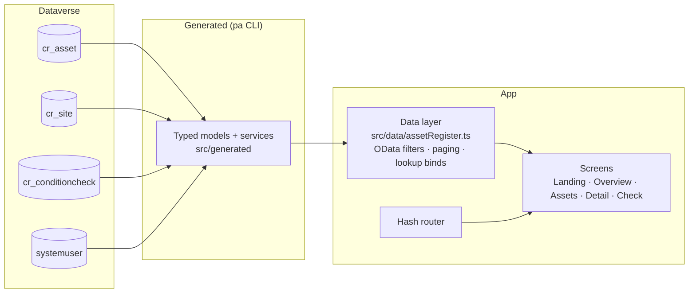

<p align="center">
  
</p>

**A Power Apps Code App (React 19 + TypeScript) on Dataverse that tracks where every piece of equipment is, who has it, and how it's holding up.**

<p>
  
  
  
  
  
  
</p>

## The problem

IT and facilities teams track laptops, monitors, AV kit, tools and furniture across several sites in spreadsheets that drift. Nobody is sure which asset is at which site or who holds it, and condition is rarely recorded until something fails.

## What it does

- **One register, scoped by site.** Search by name, asset tag or serial number, filter to a site, and page through results 50 at a time. The chosen site is remembered on each device.
- **Condition checks in seconds.** Rate an asset 1 to 5 (Poor to Excellent), add a date, who checked it and a comment. Saving also writes the latest rating and check date back onto the asset.
- **Overview dashboard.** Per-site totals, rating breakdowns, items in repair, a *Needs attention* list (rating 2 or below) and *Recently checked*. Dataverse computes every count with `$count` queries.
- **Full asset records.** Create and edit name, tag, serial, category, status, site, purchase date and cost, notes and assigned user. Each asset shows its last 20 checks.
- **Built for the host frame.** Hash routing (`#/assets/{id}/check`) keeps deep links working inside the Power Apps iframe. Inter is bundled from npm, with no font CDN.
- **Works on desk and phone.** Dense tables on desktop and cards with large touch targets on phones. Light and dark themes share one token set, and the app respects reduced-motion settings.
- **Review without a tenant.** `npm run dev:sample` swaps in sample data through a Vite plugin that is only registered in serve mode, so sample data can never reach a production build.

## How it's built



Design choices visible in the code:

- **No hand-written HTTP.** Every read and write goes through services generated from the Dataverse schema.
- **Filtering happens on the server.** Searches use index-friendly `startswith()` rather than `contains()`, and user input is escaped before it goes into OData literals.
- **IDs are validated.** Record IDs are checked as GUIDs before they go into a filter or `@odata.bind`.
- **Errors are readable.** `IOperationResult` errors are unwrapped into messages that say which action failed.

The Dataverse tables, security roles and the packaged app live in [`../solution`](../solution).

## How to run / deploy

Prerequisites: Node.js, access to a Dataverse environment with code apps enabled, and the `pa` CLI (`@microsoft/power-apps-cli`, already a dev dependency).

`power.config.json` is environment-specific and isn't committed. Copy [`power.config.example.json`](power.config.example.json) to `power.config.json` and fill in your `environmentId`. Add an `appId` only if you're updating an app that already exists.

```bash
npm install
npm run dev:sample   # screens with sample data, no tenant needed
npm run dev          # local run against Dataverse (sign in with: pa auth login)
npm run lint
npm run build        # tsc -b && vite build → dist/
npx pa app push      # publish the build to the environment in power.config.json
```

The full command-by-command flow, from scaffolding to publishing, is shown in [docs/images/code-app-build-flow-light.png](docs/images/code-app-build-flow-light.png). [docs/testing-guide.md](docs/testing-guide.md) walks through end-to-end record and security-role testing.

---

Built by [Munir Ali](https://www.linkedin.com/in/munir-ali-7b9607234/) · [Back to portfolio](../README.md)
