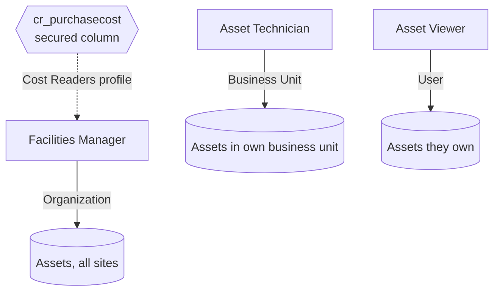

<p align="center">
  
</p>

**The unpacked Dataverse solution behind the [Asset Register](../asset-register): tables, choices, security roles and the packaged code app, all in source control.**

<p>
  
  
  
  
  
</p>

## The problem

An app is only deployable if everything it depends on moves with it: the schema, the security model and the app itself. Building those by hand in each environment leads to drift and untracked changes.

## What's inside

`PortfolioSolution` (publisher prefix `cr`, version 1.0.0.0) contains:

| Component | Details |
| --- | --- |
| **Asset** (`cr_asset`) | Name, tag, serial, category, status, site, assigned user, purchase date, purchase cost, notes, condition rating, last checked. User-owned. |
| **Site** (`cr_site`) | Name, site code, city. User-owned. |
| **Condition Check** (`cr_conditioncheck`) | Asset, check date, checked by, rating, comments. User-owned. Deleting an asset removes the link on its checks rather than deleting them (`RemoveLink`). |
| **Choices** | `cr_category`: AV Equipment, Furniture, Laptop, Monitor, Peripheral, Tool. `cr_status`: Available, Assigned, In Repair, Retired. |
| **Code app** | `cr_assetregister_288ac`: the built Asset Register bundle (HTML, JS, CSS, bundled font). |
| **Forms and views** | Main, quick and card forms plus saved views for each table. |

## Security model

Access is enforced by Dataverse through the privilege depth on each role:

| Role | Asset | Condition Check | Site |
| --- | --- | --- | --- |
| **Facilities Manager** | Full CRUD, assign, share (Organization) | Full CRUD (Organization) | Full CRUD (Organization) |
| **Asset Technician** | Create / read / write (Business Unit) | Create / read / write / delete own (User) | Read (Organization) |
| **Asset Viewer** | Read own (User) | Read (Organization) | Read (Organization) |

- **Site-level isolation.** Technicians hold Business Unit–level asset privileges, so they only see assets owned within their business unit.
- **Field-level security.** `cr_purchasecost` is a secured column. The solution references a field security profile named **Cost Readers** as a dependency, but that profile is not included in this solution.



## How to build

`PortfolioSolution.cdsproj` uses `Microsoft.PowerApps.MSBuild.Solution`, so the solution zip is packed from `src/`:

```bash
cd solution/PortfolioSolution
dotnet build
```

The zip is written under `bin/`, which is git-ignored.

---

Built by [Munir Ali](https://www.linkedin.com/in/munir-ali-7b9607234/) · [Back to portfolio](../README.md)
